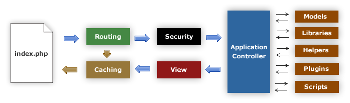
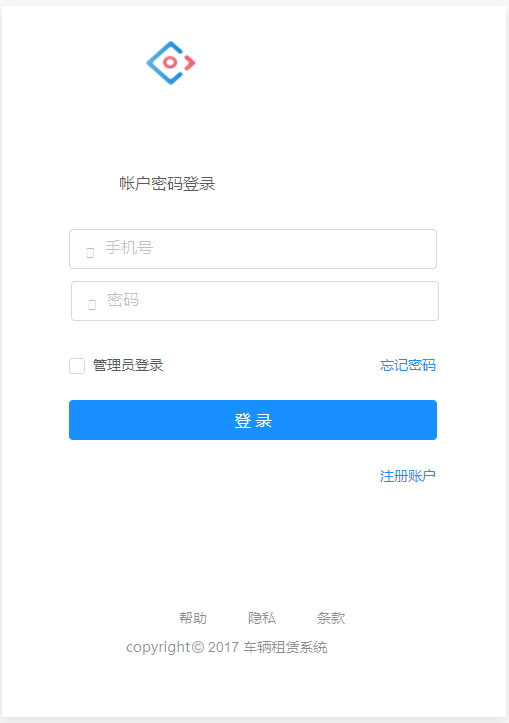

### 1 绪论 

#### 1.1 目的和意义

汽车作为人们日常生活中必不可少的交通工具，给人们生活带来了快捷和便利，但是汽车的燃油费、保养费和保险费等各项费用带来的高消费也是普通家庭很难承受的。

同时现在大城市，就算是一些高收入家庭，但是由于存在摇号政策，很多家庭很难获得车牌的资格。当很多人急着用车的时候，租车便成为大多数人的选择。城市由于交通设施的增加造成交通拥挤甚至混乱给人们的生活带来极大的不便，迫使着人们去寻求高技术的有效手段去解决这种不便。

从客观上来讲，当前人工租赁方式已经远远无法满足高速发展的汽车租赁市场的需求，突出表现为业务信息处理效率非常低下，直接导致了错误的产生，服务质量的低下。汽车租赁管理涉及很多方面，如租赁汽车的合同管理、财务管理、日常业务管理、汽车维修管理、信息管理等。通过手工方式进行租赁工作的操作，大大降低工作效率，且数据安全性也较低。在这个背景下，计算机技术的优势得以凸显，逐步在租赁工作方面发挥出越来越关键的作用。从汽车租赁管理系统的实际功能设置来看，其核心为车辆租赁的日常业务，运用这一系统的目的在于提高汽车租赁服务的效率，进而降低人力以及物力成本。

随着人民生活水平的日益提高和国家对公务用车的大力改革，使得汽车租赁行业成为一个发展前景诱人的行业，汽车租赁行业有自身独特的优势，需要使用汽车的个人和企业，在无需办理汽车保险，根据实际需要选择各种车型，极大的方便了个人和企业的用车需求。 

对于未来汽车租赁的发展，从国家政策上我们可以看出，国家对于发展汽车租赁有着比较明确的发展规划。 

总结说了，随着生活水平的提高，随着信息化水平越来越高，租车行业有着极大的发展空间，这点必须是我们需要认识的。

接下来我们需要了解下目前的租车系统和租车行业。

#### 1.2 现状

随着互联网行业的不断发展，计算机技术的快速普及，使得信息技术在多个领域发挥出了越来越关键的作用，企业管理领域也不例外。其中，交通运输行业是社会发展、国家经济的重要基础，直接关系到整个国家经济的发展前景。国家政府也关注到了交通运输行业的重要作用，为了促进此领域的健康发展，相继制定了一系列的扶持政策，并为基础设施建设提供了充足的资金保障，在这个背景下，大量车辆的科学运营成为了当前一个备受关注的热门课题。社会对于运输行业统筹管理的呼声越来越高，交通运输行业的管理系统也应运而生，本项目设计是以运输行业中的车辆租信息管理作为研发目的的。

纵观租车行业的发展历程，可以发现，在上世纪末期，此行业利润普遍较为丰厚，许多商家纷纷将目光投向了此领域。从现阶段租车行业的发展情况来看，其从业人员数量呈现出稳定的增长状态，发展前景较为广阔。

在当今社会租车已成为一种时尚，但其现有的汽车租赁工作大多采用传统的人工操作，基于此，经过对汽车租赁日常工作中的车辆信息、客户管理及租车管理工作作相应调查后，将现有的人工操作流程作如下分析：

（1）车辆登记 

对车辆的信息和数量进行登记 

（2）租车管理：客户到租车行看车然后选车，管理员将租车日期填写在租车表中，同时将一张租车证给客户，收回车辆时回收租车证。

（3）这种传统人工的管理方式存在着许多缺点，比如：效率低、保密性差，对车辆的情况不了解不深；另一方面日常租赁管理工作使得工作人员手足无措，随着租赁的运营，将积累大量的数据和文件，给工作人员日常的信息查找、更新、维护带来了很大困难，不仅需要耗费巨大劳动力，还容易造成数据出错，如租车证遗失后管理员通常要翻阅很多信息资料才能找到租车信息。

为了更好地开展车辆租赁活动，使客户租赁车辆的流程更加简单方便。很多汽车租赁公司逐步关注到了信息技术的优势，纷纷加快了对于信息管理系统的探索，车辆租赁管理也逐步朝着信息化、数字化的方向迈进。这种新型的汽车租赁模式，主要以互联网平台为依托，将数字化作为汽车租赁行业发展的新动力，以期用信息化的理念改变人们的生活、工作、思维等方式，从而更好地服务于用户，提高汽车租赁行业各方面工作的效率和质量，创造更多的经济效益。

#### 1.3 论文研究内容

本文主要研究汽车租赁管理系统的设计及实现，采用 XAMPP 开发平台，主要实现了一个 B/S 架构的车辆管理系统，利用软件工程和面向对象的思想和方法，从需求收集到需求分析再到将需求转化成可实现的功能模块，主要采用 PHP 语言编程实现各个功能模块。具体涉及的主要工作如下：

（1）对目前的租赁市场进行调研，根据调研结果对汽车租赁管理系统作需求分析，将业务需求转化为系统的逻辑功能模块，以逻辑功能模块为单位开发租赁系统。

（2）基于系统的需求分析结果，对汽车租赁管理系统的总体架构进行设计，选择合适的软件技术硬件设备，依据设计的总体架构对各个功能模块进行划分，并分别对各个模块作详细设计。

（3）数据库作为系统中最重要的组成部分，设计完成数据库的逻辑结构，以配合功能模块的数据处理。

（4）采用选定的相关技术，按照划分及设计好的功能模块及数据库逻辑结构实现系
统的各个功能模块。

（5）测试并验证完成后的汽车租赁管理系统，设计测试用例，对系统的各个功能模块逐一进行测试，并与预期的结果进行对比，以验证系统的可行性、稳定性。

### 2 需求分析 

系统需求分析作为系统开发的一个重要环节，也是系统开发的第一步，其决定了开发的软件系统的质量。在分析过程中，首先要清楚设计该系统的目的，并明确系统要实现的功能模块。系统的相应功能模块要与用户的需求相匹配，将用户的需求转化为详细的系统工程需求。 

#### 2.1 业务需求分析 

通过对汽车租赁企业的日常业务进行调研，对其进行总结得出汽车租赁管理系统需要实现如下几方面的功能：

（1）客户查看，预定车辆信息

传统的租车行业，客户需要专程到租车公司，查看待出租的车辆，而且租赁公司工作人员需要全程陪同，对于客户来说非常不方便，也浪费双方的时间。

现在客户更愿意在互联网上挑选自己喜欢的车辆，如果感觉合适，可以直接预定车辆，然后在规定的时间提车，预定的金额就是定金，按照天计算价格，如果在规定的时间没有选择租车，则租赁公司有权收回定金（实际金额按照每天价格计算），这个定金相当于违约金。

客户也可以选择通过电话来预定车辆，如果客户还不是该系统的客户，管理员可以替客户注册，客户也可以预定车辆，但是预定的车辆不能锁定。

客户当然也可以直接去现场选择喜欢的车辆。

（2）租赁车辆功能。

客户预定车辆后，在规定的时间可以去现场选车，管理员根据客户选定的车辆供客户查看，客户确认车辆没有问题后，选择提车。

提车需要注意实际的提车时间，收费模式，规划定金。确定租赁需要管理员在系统中操作。

（3）智能化的还车

客户使用完车辆后，接下去进行还车，系统会根据使用时长，收费模式，计算出可能的总金额，一旦确认换车，该订单的状态就会更新，表示这笔订单完成。详细的订单费用也会更新，客户选择可以直接微信、支付宝支付，也可以从原有账户中扣除费用。

一旦订单完成，该车辆的状态也会更新，其他客户选择使用该车辆，当然管理员也可以对车辆进行保养，然后再发布为可出租状态。

还车的时候，管理员需要检查车辆是否有损坏，如果有损耗，有租赁公司统一进行维修，维修费用主要由客户承担，但是一且由租赁公司代理操作，不过耽误客户的时间。具体的维修费用会更新到该笔订单中。

客户也可以选择由租赁公司来负责收车，当然需要收取一定的费用。

（4）更新智能化的车辆发布管理。

传统租赁公司，车辆的管理维护更多的是手工操作，或者由单机的软件系统来进行管理，操作的时候非常的不方便。

对于新型的车辆租赁管理系统来说，管理员可以更方便的对车辆进行管理，上传照片，维护车辆状态，极大的节省了成本和时间。

（5）数据管理

基于车辆数据、订单数据、用户信息，该系统可以基于大数据了解系统管理的所有数据，方便管理员更好的进行决策。

了解的信息非常丰富，比如了解用户更钟爱使用那种车辆，更喜爱几座的车辆，平均租赁时间是多久，那个时间点客户跟倾向租车，基于这些信息，管理员能够更好的调度车辆信息。

基于大数据，能够统计每天的收入，了解租赁费用，违约金费用，维修费用，油费，其他的杂项费用。

基于业务需求，在本论文第三部分，会从技术上将需求抽象为各个模块。

#### 2.2 可行性分析

现今社会的方方面面均已提高效率为至上目标，传统的采用手工操作的方式不仅浪费人力物力，也大大降低生产效率。因此，论文设计该汽车租赁管理系统以协助企业管理租赁相关业务，提高管理效率，节约资源。

可行性分析的目的是能够以最少的成本尽可能快地解决现有问题。其通过抽象的方式对系统进行分析和设计，从而确定系统的可开发性以及可能遇到的问题，并确定相应的解决方法。

1）技术分析

现在软件开发技术以 B/S 架构为主，现在电脑的普及率越来越高，手机设备越来越高，这种系统价格能够很好的满足业务的需求。

现有的系统开发技术通常为面向对象的程序语言以及结构化、模块化的程序设计，以使系统的开发过程更加规范，更符合统一标准，增强后续应用的可扩展性。

总结下来，对于该系统来说，从技术上有如下的一些特点：

（1）数据要求更新及时、快速。

订单信息会涉及到费用、车辆信息，这些数据在更新的时候，必须快速，准确。

只有信息快速更新，客户才能浏览到最新的车辆信息。

（2）数据处理严谨

客户的租车涉及到金额，在操作的时候，一定要严谨，每个操作，必须计入日志，方便后续的检查。

（3）功能可扩展

对于租赁，计费是非常复杂的一个过程，根据国家的政策，收费的规则和标准都是动态变化的，对于系统来说，一定要根据产品需求，能够快速的支持。

（4）系统响应能力

该系统，数据量很大，客户使用量也很大，在技术进行实现的时候，页面和接口的响应一定要快速，系统的支撑能力能够动态进行调整。

其次，基于上述特征选择相应的开发工具，使其能够通过相应的技术实现开发。对于 B/S 架构的系统，一般采用 MVC 开发模式，PHP 作为最流行的业务开发语言，非常的灵活，拥有众多的库函数，能够很好的支撑开发。

该系统选用 apache 作为服务器，apache 是世界上最流行，使用最广泛的应用服务器，能够很好的支撑业务开发。

而数据存储采用关系型数据库 MySQL，由于其支持多种操作系统，能够为多种编程语言提供 API 接口，支持多线程，能够提供 TCP/IP 等多种数据库连接途径，基于其所述的多种优势采用其进行数据库的设计。

上述这些系统都是开源的软件，在稳定性、可靠性、性能方面都能很好的支持，同时，采用 B/S 架构的系统仅需使用者懂得基本的网络常识，通过浏览器进入系统进行相关操作即可。

2）企业考虑 

汽车租赁管理系统软件的开发能够使得汽车租赁企业的管理系统更加完善，数据的处理更快速智能，信息的统计更科学完整，日常业务的处理更加精确高效，从而提高用户满意度以及经济效益。

对于租赁公司来说，部署系统需要购买硬件，需要支付一定的费用，开发管理系统也需要开发费用，后期的系统维护、升级也需要额外的费用，但是这些软件费用在企业成本中占比并不高。

同时该系统管理后台主要由租赁公司员工使用，对他们进行简单的培训，就能很好的使用该系统。

综上可知，本论文所述汽车租赁管理系统的开发在软硬件投入、人员经费及其他方面的支出都是较为合理的。而系统的能够实现所需的业务需求，处理大量的数据，相比传统的手工操作，能够大大减轻企业工作人员的工作量，同时提高企业的整体效率和管理水平，在经济上具备可行性。

#### 2.3 系统功能需求

对于车辆租赁系统来说，核心的是完成产品的需求，但是软件性的功能也非常重要，直接影响客户和管理员的使用，重要性不言而喻。

（1）扩展性

对于车辆租赁系统来说，底层的架构一定要灵活，可扩展，方便后续的二次开发。由于系统的功能会随需求的变化而变化，这些变化不应该影响到系统逻辑模块的处理功能，因此系统的显示功能和逻辑处理功能分离，使得当对系统的显示功能做相应修改时，不影响系统的逻辑处理模块，提高系统的开发灵活性。

（2）安全 

对于 B/S 系统来说，客户端的情况非常复杂，如果服务的部署不严谨，或者软件开发质量不高，很容易出现安全性的问题。

在开发该系统过程中，一定要充分考虑到浏览器的复杂性，避免出现安全漏洞，比如可以采用 HTTPS 协议部署该系统，保障系统的安全性。

（3）兼容性 

由于该系统不是单机系统，采用标准的 HTTP/1.1 协议进行通信，为了保障良好的客户体验，必须保证在不同的系统、平台、浏览器都能很好的使用该系统。

主流的浏览器，比如微软 Edge、谷歌的 Chrome、Mozilla 的 Firefox 都是比较主流的浏览器。

（4）稳定性 

对于一个系统来说，稳定性是非常重要的，如果一个系统功能频繁出现问题，或者服务器响应缓慢，都会影响客户的使用，更重要的是影响企业的品牌形象，所以必须保证稳定性，性能应该有所保证。服务质量至少要达到 99.9。

### 3 系统设计

#### 3.1 架构和开发模式 

在本章节中，将介绍以下内容：

- B/S 架构相比 C/S 架构的优点。
- 整体的系统架构图
- XAMPP 平台的介绍
- MVC 开发模式 

这些内容在软件开发过程中非常重要，直接决定了系统的质量。
 
1）B/S 架构相比 C/S 架构的优点

所谓 B/S技术，就是浏览器/服务器技术，目前进行基于Web系统开发的主流架构技术。

随着IT技术的发展，基于C/S架构的系统软件技术缺陷明显：

（1）需要有专门的客户端和系统才能运行系统，主要运行在 PC 电脑上，而现在手机设备越来越多，移动资费越来越便宜，传统的 C/S 架构已经不能很好的满足需要了

（2）客户端很难进行升级，可能需要安装特定的一些包，可移植性相对较差。

（3）C/S 架构，都是一些传统的软件开发模式，很难利用现有技术、设备的一些新特点。

那什么是 B/S 架构呢？对于客户来说，任何设备，不管是 PC 电脑或者手机设备，只要有浏览器，就能使用系统。

其特点主要如下：

（1）客户端基于 HTTP（Hyper Text Transfer Protocol），即超文本传输协议，与服务器进行通信，而 HTTP 是互联网最流行的应用层协议，使用起来非常方便。

（2）客户端要求低，客户体验好。

客户或者管理员只需要一个浏览器，就能在世界各地使用该系统，减少搭建系统的运行环境以及安装其他系统工具或软件的工作，进一步提高了系统易用性、可扩展性以及安全性。

（3）维护成本低，系统更新升级方便。

基于B/S架构的软件系统在维护和升级过程中只需要在服务器端进行，与客户端没有关系，这样即使进行频繁的系统维护和升级前端用户也不会有太大感知，用户的体验非常好。

现在的互联网系统，最大的一个特点，就是更新及时，为了更好的支持新特性，系统的服务器端必须能够透明的拓展新功能。

（4）能够利用一些新技术

现在的浏览器种类比较多，各大互联网公司都在积极推广新技术，比如 HTTP/2 协议，HTML5 技术，这些新技术对于系统的性能有着极大的帮助。

（5）由于数据库仅与服务器进行数据交互，无需与外部设备进行连接，从而提高了系统的安全性。

为了进行 B/S 架构的开发，现在也有越来越多的开源软件支持，比如 PHP、Python、Java 语言，Apache、Nginx 等主流 Web 应用服务器，也有 Mysql 这样流行的开源数据库管理系统和存储系统。

2）整体的系统架构图 

在进行设计的时候，系统架构需要满足以下几个特点：

1）可伸缩的

当系统访问量越来越大，数据容量越来越大，整个系统应该是可伸缩的。现在云服务也越来越多，能够很好的进行支撑。

在本论文设计的系统中，整个服务运行于阿云云平台上。

2）分层架构

目前，比较通用的架构主要是三层架构，每个单元之间都是互相隔离和关联的，也很容易进行替换，整个系统移植性非常好，比如服务器如果将从 Apache 变更为 Nginx ，那么非常的简单。

3）开源

B/S 架构中，非常流行的就是应用开源软件，开源软件有着大公司和众多软件开发人员的支持，整个安全性和性能都有保证，在介绍 XAMPP 平台的时候，会详细说明。

整体的系统架构图如下：


<center>图3-1：系统架构图</center>


介绍下系统架构图中的各个组成部分：

- 浏览器，任何一个支持 HTTP 协议的客户端都可以访问该系统。
- Web 服务器，接收 HTTP 请求的服务器，代表的有 Nginx、Apache，特点就是能够接收很多的请求，并发能力好，实现了 HTTP 协议的各种功能。
- 应用服务器，主要接收 Web 服务器的请求，负责逻辑处理，在本系统中，主要由 PHP-FPM（PHP）语言进行开发。
- 数据库服务器，主要存储该系统中的所有数据。

基于 B/S 系统架构：

客户或者管理员访问系统（网站），仅仅需要借助浏览器即可完成，首
先，客户端浏览器向目标系统的 Web 服务器进行请求发送，Web 服务器接收到请求后，交由应用服务器处理，应用服务器根据系统的逻辑处理，查询数据库、更新数据库，最后返回数据给客户端。

从上面的流程，也可以看出，客户端的工作量非常少，主要完成请求、解析、渲染的工作。服务器的工作比较多，所有的业务逻辑都由后端完成，如对用户请求的解析、处理和响应，以及对数据的增删改将在服务端执行。

如果系统的支撑能力不够，可以快速的扩容 Web 服务器和数据库，从而有效的进行系统支持。

3）XAMPP 平台

在设计好系统架构后，需要选择合适的开发平台、部署各类 Web 服务器、应用服务器，而这些都是有一定复杂度的，为了方便安装各类软件，在开发车辆租赁系统的时候，最终选择 XAMPP 软件。

XAMPP是最流行的PHP开发环境，能够给开发者快速构建完成的系统，核心系统包括 Apache、PHP、Mysql、phpMyAdmin 。XAMPP 能够部署在各类操作系统上，比如 Window、Linux、OS X 系统中。在开发车辆租赁的系统时，最终所有服务选择部署在 Windows 平台上，原因就是拥有图形化的管理界面，更容易操作。

（1）PHP

PHP（Hypertext Preprocessor ）是一种通用开源脚本语言，是一种解析型语言，语法类似于 C 语言，整体上使用非常灵活，使用非常的广泛，是一种最容易学习的编程语言，有着丰富的库。用PHP做出的动态页面与其他的编程语言相比，PHP是将程序嵌入到HTML（标准通用标记语言下的一个应用）文档中去执行，执行效率比完全生成HTML标记的CGI要高许多

PHP 语言最大的特点就是效率高，不管是运行效率，还是开发效率，都非常快速，跨平台性强，可以运行在大多数主流操作系统上，目前 PHP 已经到了 PHP7.2 版本，在开发车辆租赁系统的时，还是使用比较稳定的 PHP 5.6 版本。

（2）Apache 

Apache是世界上最流行的Web服务器软件。它可以运行在几乎所有广泛使用的计算机平台上，由于其跨平台和安全性被广泛使用。

Apache 有着丰富的 API 接口，可以支持 PHP、Tomcat、Python 等主流开发语言和应用服务器。在车辆租赁系统中，主要使用 MOD_PHP 模块负责和 PHP 语言进行交互。

Apache web服务器软件拥有以下特性：

- 基于 HTTP 协议开发出来的 Web 服务器。
- 拥有简单而强有力的基于文件的配置过程
- 支持通用网关接口
- 支持虚拟主机的配置方式
- 集成代理服务器模块
- 提供用户会话过程的跟踪
- 支持 FastCgi 协议 

（3）Mysql 

MySQL是一个关系型数据库管理系统，目前属于 Oracle 旗下产品，是世界上最流行的数据库开源软件。

MySQL所使用的 SQL 语言是用于访问数据库的最常用标准化语言。MySQL 软件采用了双授权政策，分为社区版和商业版，由于其体积小、速度快、总体拥有成本低，尤其是开放源码这一特点，一般中小型网站的开发都选择 MySQL 作为网站数据库。

Mysql 不管在性能上，还是功能上，都有着成熟的应用，而且基于主辅同步，在满足数据备份的基础上，也能更好的进行分布式查询。

（4）phpMyAdmin 

phpMyAdmin 是一个用 PHP 语言开发出的 Mysql 图形化管理系统，通过该系统，不用使用复杂的命令行管理数据库，有着强大的图形化操作界面，能够让开发者简单、高效的管理数据库。

4）MVC 开发模式

在具体开发的时候，一定要选择一个优秀的开发模式，在车辆租赁系统中，最终采用了 MVC 模式。

MVC全名是Model View Controller，是模型(model)－视图(view)－控制器(controller)的缩写，一种软件设计典范，用一种业务逻辑、数据、界面显示分离的方法组织代码，将业务逻辑聚集到一个部件里面，在改进和个性化定制界面及用户交互的同时，不需要重新编写业务逻辑。MVC被独特的发展起来用于映射传统的输入、处理和输出功能在一个逻辑的图形化用户界面的结构中。

MVC开始是存在于桌面程序中的，M是指业务模型，V是指用户界面，C则是控制器，使用MVC的目的是将M和V的实现代码分离，从而使同一个程序可以使用不同的表现形式。

MVC 是一种使用 MVC（Model View Controller 模型-视图-控制器）设计创建 Web 应用程序的模式：

- Model（模型）表示应用程序核心（比如数据库记录列表）。
- View（视图）显示数据（数据库记录）。
- Controller（控制器）处理输入（写入数据库记录）

MVC 模式同时提供了对 HTML、CSS 和 JavaScript 的完全控制。

Model（模型）是应用程序中用于处理应用程序数据逻辑的部分。通常模型对象负责在数据库中存取数据。

View（视图）是应用程序中处理数据显示的部分。通常视图是依据模型数据创建的。

Controller（控制器）是应用程序中处理用户交互的部分。

通常控制器负责从视图读取数据，控制用户输入，并向模型发送数据。MVC 分层有助于管理复杂的应用程序，因为您可以在一个时间内专门关注一个方面。例如，您可以在不依赖业务逻辑的情况下专注于视图设计。同时也让应用程序的测试更加容易。MVC 分层同时也简化了分组开发。不同的开发人员可同时开发视图、控制器逻辑和业务逻辑。

在开发该车辆租赁系统的时候，最终选择了一个很好的 PHP 开发框架，这就是 CodeIgniter 框架，是一个非常典型的 MVC 框架。

关于 CodeIgniter 框架，在论文第四部分会详细介绍，最后通过一张图描述 MVC 结构。


<center>图3-2：MVC</center>


#### 3.2 系统模块设计 

系统模块设计以及功能模块划分主要是面向实际应用需求而展开筹划的，在该系统中，主要分为 6 个模块，登录模块，系统管理模块，用户管理模块，租赁管理模块，财务管理模块，车辆管理模块。这些模块中最复杂的模块是租赁管理模块，涉及到租车预定，租车，还车等子模块。

这些模块主要提供给租赁公司人员和客户使用的，为了更好的使用该系统，系统分为三个角色，三个角色分别是超级管理员、管理员、客户。每种角色可以自定义使用上述 6 个模块，由租赁公司的超级管理员负责权限分配。

系统模块关系可以见下图：


<center>图3-3：系统模块关系图</center>


接下去，简单介绍下各个模块的关系。

1）登录模块

租赁公司的超级管理员、管理员和客户都可以登录该系统，从而进行各类管理工作。登录系统后，根据登录人员的角色，根据权限，可以使用系统各个子模块。

2）用户管理模块

不管是管理员还是客户，都可以对自己的信息进行管理，比如修改用户密码等信息。

同时客户也可以自主注册为该系统的用户，而不是像传统系统那样，由管理员录入用户信息。

3）系统管理模块 

该模块由多个子模块组成。

（1）客户管理模块

对客户信息进行管理，增加、删除、修改用户信息。

查询用户信息，比如浏览器每个用户的租车记录。

（2）订单管理模块 

管理员可以对自己名下的订单进行管理。

（3）员工管理模块

该权限只有超级管理员才能操作，管理员工信息，分配员工权限。
 
4）车辆管理模块

该模块主要是租赁公司管理员使用，主要录入车辆，更改车辆信息，维护车辆状态（可出租、维修等），

5）租赁管理模块

这是最重要的一个模块，分为几个子模块。

（1）车辆预定子模块

客户可以在线查询车辆状态，选择是否有满意的车辆，也可以预定车辆。

对于不经常上网的客户，客户可以以电话的方式预定车辆，租赁公司的管理员可以为电话用户预定车辆。

（2）租车子模块

客户预定车辆后，可以去现场查看车辆，确认无误后，可以选择租车，一旦开始租车，就代表可以收费了。

可以根据车辆的日租车价格、月租车价格进行计费。

对于该子模块来说，主要由管理员操作。

（3）还车子模块

客户使用完车辆后，可以去现场还车，管理员检查无误后，选择结束租车，并计算客户花费的费用。

如果客户在使用过程中出现事故，车辆受到顺坏，租赁公司会选择替客户维修，维修费用主要由用户负担。

6）财务管理模块

租赁公司可以查看每天产生的订单，每天的收入，基于订单数据，可以进行多维度的数据分析，从而更好的进行管理。

#### 3.3 系统流程设计 

从流程设计情况来看，主要依照不同角色的操作行为来进行操作流程的划分。

主要分为 4 个流程

1）登录流程 

在该系统中，不管是用户、管理员，还是超级管理员，登录入口都是统一的。

当然有些模块是不需要登录的，但是一旦涉及到需要身份信息，该系统都会出现登录窗口，登录成功后，可以继续进行操作。

登录的时候，都必须验证登录信息，当信息正确情况下可以成功登陆，否则重新登陆。

具体流程见下图：


<center>图3-4：登录流程图</center>

 
2）车辆展示及预定流程

任何访问该系统的用户，能够看到所有的车辆信息，如果客户想预定车辆，必须登录该系统。

如果没有成为该系统的用户，可以注册成为一个用户。

客户在该系统中筛选喜欢的车型、颜色、价格等信息，如果选中的车辆，可出租，可以预定车辆，预定后，就可以去现场办理租赁了。

具体预定流程见下图：


<center>图3-5：车辆预定流程</center>


3）租赁流程。

完成车辆预定后，客户可以在规定的时间去办理租赁，如果没有去办理，则客户的定金就会归入租赁公司，车辆会释放为可租赁状态，原有预定的订单会更改状态。

对于客户来说，需要去现场办理租赁，在租赁之前，先要预定车辆。

预定车辆可以由客户在系统中办理，也可以由管理员替客户操作。

在租赁的时候，主要包括以下步骤：

- 管理员查看预定订单信息，查看待租赁客户是否已经预定车辆。
- 客户查看待租车辆，查看是否有问题。
- 确认没有问题后，该订单生效，开始计费。并且该车辆置为“已出租”状态。

具体租赁流程见下图：


<center>图3-6：车辆租赁流程</center>


4）还车流程

客户使用完车辆后，可以去现场办理退车手续，如果车辆顺坏，或者不方便，可以让租赁公司来负责收车，受车费需要一定的费用。

租赁公司管理员检查车辆无误后，可以选择还车，如果检测后发现出现问题，由租赁公司负责维修，但是客户需要支付维修费。

最终还车完成后，需要进行:

- 车辆置为可出租状态。
- 订单置为完成状态，用户可以选择使用支付宝、微信付款。
- 订单费用明细表更新，包括租赁费（标准的价格），维修费，收车费，其他杂项费用。

具体还车流程见下图：


<center>图3-7：还车流程</center>

#### 3.4 数据库设计

从整体角度来看，数据库设计工作的重要性是不言而喻的，必须要将其摆在一个至
关重要的位置上来看待，明确其在数据安全性、处理效率、可扩展性方面的重要作用。

1）数据库设计原则

（1）一致性原则 

对租赁信息进行系统、统一的分析与设计，协调好各种不同结构的数据源，保证系统数据的有效性和一致性。

（2）完整性原则 

要防止用户以合法身份访问的前提下进行非法指令或数据的添加，在此基础上应该制定相应的数据审核机制，确保数据的正确性和相容性。

（3）安全性原则 

要设计认证和授权机制，避免出现由于任何原因所造成的数据破坏、泄露或是更改等问题。

（4）可伸缩性原则

出于对系统未来发展的考量，应该在数据库设计过程中兼顾以下三方面的内容，分别为：适度冗余、扩展性以及伸缩性。
  
（5）规范化
在数据库设计过程中，必须要将规范化理论视为一项原则性的要求来看待，避免出现数据冗余、修改或是删除异常等情况的出现，在合并或是分解关系模式的基础上将其转换成高级范式。一般而言，做到第三范式就足够了。

2）数据库的需求分析

针对汽车租赁管理系统的需求，通过对信息管理展开细致而深入的探究，完成了数
据结构以及数据项的设计工作：

（1）用户信息表，包括用户编号，用户姓名，身份证号，性别，手机号，家庭地址，邮箱，驾驶证编号，备注，登录密码，预存金额。

（2）员工信息，包括员工编号，姓名，身份证，手机号，角色。

（3）车辆信息，包括车辆编号，车牌号，车牌型号，状态，是否出租，颜色，出租次数，日租赁价格，月租赁价格，车辆照片编号。

（4）订单信息，包括用户编号，车辆编号，租赁形式，预定开始时间，预定结束时间，取车时间，完成时间，预定金，总费用，订单状态。

订单状态如下：

- 预定状态。
- 租赁状态，客户确认无误后，才开始计费。
- 完成状态，完成租赁计费。
- 订单违约状态，客户支付了定金，但是没有实际租赁
- 订单作废状态。

（5）费用信息，包括订单号，费用类型（租赁，维修），金额。
 
2）数据库的结构逻辑设计

（1）用户信息表 tb_user

```
CREATE TABLE `tb_user` (
 `id` int(10) unsigned NOT NULL AUTO_INCREMENT, # 自增 ID
 `username` char(20) NOT NULL, # 用户姓名 
 `pwd` char(20) NOT NULL,  # 密码
 `sid` char(20) NOT NULL, #身份证号
 `gender` int(10) NOT NULL, # 性别，0 表示男，1 表示女
 `tel` char(20) COLLATE utf8_bin NOT NULL, # 电话
 `addr` char(50) COLLATE utf8_bin NOT NULL, #地址
 `email` char(20) COLLATE utf8_bin NOT NULL, #email
 `carid` char(20) COLLATE utf8_bin NOT NULL, #驾驶证编号
 `othinfo` char(200) COLLATE utf8_bin NOT NULL,#备注
 `money` char(20) COLLATE utf8_bin NOT NULL,#预存钱
 `time` int(10) NOT NULL, //注册时间
 PRIMARY KEY (`id`), #主键
  KEY `tel` (`tel`) #索引
) ENGINE=InnoDB DEFAULT CHARSET=utf8 COLLATE=utf8_bi
```

（2）员工信息表 tbl_staff
  
```
  CREATE TABLE `tbl_staff` (
 `id` int(10) unsigned NOT NULL AUTO_INCREMENT, #员工编号
 `username` char(20) COLLATE utf8_bin NOT NULL,
 `sid` char(20) COLLATE utf8_bin NOT NULL,
 `tel` char(20) COLLATE utf8_bin NOT NULL,
 `role` int(10) NOT NULL DEFAULT '0',
 PRIMARY KEY (`id`),
 KEY `tel` (`tel`)
) ENGINE=InnoDB DEFAULT CHARSET=utf8 COLLATE=utf8_bin
```

（3）车辆信息表 tel_car

车辆信息，包括车辆编号，车牌号，车牌型号，状态，是否出租，颜色，出租次数，日租赁价格，月租赁价格，车辆照片编号。

```
    CREATE TABLE `tel_car` (
 `id` int(10) unsigned NOT NULL AUTO_INCREMENT, #车辆编号，自增 ID
 `carnumber` char(20) COLLATE utf8_bin NOT NULL, #车牌号
 `cartype` char(20) COLLATE utf8_bin NOT NULL, #车牌型号
 `status` int(10) NOT NULL, #状态，可出租（0）、维修（1）、报废（2）
 `isrent` int(10) NOT NULL, #是否可出租，可出租（0），已出租（1）
 `color` char(20) COLLATE utf8_bin NOT NULL, #颜色
 `rentcount` int(10) NOT NULL, #已出租次数
 `dprice` char(20) COLLATE utf8_bin NOT NULL, #日出租价格
 `mprice` char(20) COLLATE utf8_bin NOT NULL, #月出租价格
 `info` char(200) COLLATE utf8_bin NOT NULL, #车辆描述信息
 PRIMARY KEY (`id`),
 KEY `carnumber` (`carnumber`)
) ENGINE=InnoDB DEFAULT CHARSET=utf8 COLLATE=utf8_bin
```

（4）车辆照片表 tel_car_photoid 

所有车辆对应的照片存储在该表中

```
CREATE TABLE `tel_car_photoid` (
 `id` int(10) unsigned NOT NULL AUTO_INCREMENT,
 `tel_car_id` int(10) NOT NULL, #tel_car 表车辆的编号
 `url` char(30) COLLATE utf8_bin NOT NULL, #图片路径
 PRIMARY KEY (`id`), 
 KEY `tel_car_id` (`tel_car_id`) #索引
) ENGINE=InnoDB DEFAULT CHARSET=utf8 COLLATE=utf8_bin
```

（5）订单表 tbl_order

```
CREATE TABLE `tbl_order` (
 `id` int(10) unsigned NOT NULL AUTO_INCREMENT,
 `tbl_user_id` int(10) NOT NULL, #用户表 id 
 `tbl_car_id` int(10) NOT NULL, #车辆表 id 
 `sale_type` int(10) NOT NULL, #出租类型，日租（0）和月租（1）
 `time` int(10) NOT NULL, #订单产生时间
 `preset_time` datetime NOT NULL,#预定时间 
 `preset_time2` datetime NOT NULL,#预定结束时间
 `create_time` datetime NOT NULL,#租赁开始时间
 `end_time` datetime NOT NULL, #租赁完成时间 
 `sale` char(10) COLLATE utf8_bin NOT NULL, #总费用。
 `deposit` char(10) COLLATE utf8_bin NOT NULL, #预定金
 `auserid` int(10) NOT NULL, #办理租赁的管理员 ID 
 `buserid` int(10) NOT NULL, #办理租赁完成的管理员 ID
 `status`  int(10) NOT NULL,# 状态（预定、出租、完成）
 PRIMARY KEY (`id`),
 KEY `tbl_user_id` (`tbl_user_id`), 
 KEY `tbl_car_id` (`tbl_car_id`),
 KEY `status` (`status`)
) ENGINE=InnoDB DEFAULT CHARSET=utf8 COLLATE=utf8_bin
```

（6）费用信息表 tbl_sale 

```
CREATE TABLE `tbl_sale` (
 `id` int(10) unsigned NOT NULL AUTO_INCREMENT,
 `tbl_order_id` int(10) NOT NULL DEFAULT '0', #订单编号 
 `type` int(10) NOT NULL DEFAULT '0', #费用类型
 `sale` char(20) COLLATE utf8_bin NOT NULL DEFAULT '0', # 费用金额
 PRIMARY KEY (`id`),
 KEY `tbl_order_id` (`tbl_order_id`)
) ENGINE=InnoDB DEFAULT CHARSET=utf8 COLLATE=utf8_bin
```

3）E-R 图

Mysql 数据库是关系型数据库，表之间都是由一定关联的，为了描述表之间的关系，一般采用 E-R 图进行描述。

E-R图也称实体-联系图(Entity Relationship Diagram)，提供了表示实体类型、属性和联系的方法，用来描述现实世界的概念模型。


<center>图3-8：E-R关系图</center>

这几张表存在多个关系：

- 订单表 tbl_order 的 tbl_user_id 字段与用户信息表 tbl_user 表的 id 字段关联。
- 订单表 tbl_order 的 auserid 字段与员工表 tbl_staff 表的 id 字段关联。
- 订单表 tbl_order 的 buserid 字段与员工表 tbl_staff 表的 id 字段关联。 
- 订单表 tbl_order 的 id 字段与费用信息表 tel_sale 表的 tbl_order_id 关联。
- 车辆表 tbl_car 的 id 字段与订单表 tbl_order 的 tbl_car_id 字段关联。 

### 4 系统实现 

本论文的第四部分主要讲解如何实现这套车辆租赁系统，主要分为两个步骤，首先要根据系统价格，部署软件的运行环境。部署环境后，就是开发代码，并将代码部署到服务器上，从而提供完整的服务。

#### 4.1 系统环境搭建 

在论文第三部分系统架构部分，介绍到该系统使用 XAMPP 软件在硬件上安装服务，主要原因就是方便，易管理。

1）XAMPP 版本 

XAMPP 安装在阿里云 ECS 服务器上，选择的服务器是 Windows Server。

申请 ECS 服务器非常方便，主要参考面两张图。


<center>图3-9：ECS 机器类型</center>


<center>图3-10：ECS Windows 服务器</center>

2）XAMPP 软件的安装。

（1）下载 

进入下载页面 https://www.apachefriends.org/zh_cn/download.html 下载软件，挑选的是比较稳定的版本 5.6.8。

使用的软件版本如下：

- PHP：PHP 5.2.0 
- Apache：2.4.12 
- Mysql：5.6 。 

（2）安装和配置 

安装和启动 XAMPP 非常简单，见下图：


<center>图3-10：XAMPP 安装（1）</center>


<center>图3-10：XAMPP 安装（2）</center>


<center>图3-13：XAMPP 安装（3）</center>

（3）启动各个服务

启动服务很简单，打开 XAMPP 控制面板，如下：


<center>图3-14：XAMPP</center>

- 点击 Apache 的启动就可以运行 Apache 服务器和 PHP。
- 点击 Mysql 的启动就可以运行 Mysql，点击 Admin，就可以进入 phpMyAdmin ，管理数据库。

3）配置 Apache、PHP、Mysql 

（1）配置 Apache 。

车辆租赁系统运行需要一个域名，在本域名中使用 www.example.com，然后将该域名的 DNS 指向配置到阿里云的 Windows 服务器上。

接下来就是配置虚拟主机，查看 Apache的 httpd.conf 

```
<VirtualHost 202.108.3.27:80>
        AddDefaultCharset utf-8
 
        DocumentRoot C:\xampp\htdocs\carmanager
        ServerName www.example.com
</VirtualHost>
```

上述指令：

- DocumentRoot：配置代码的存放目录。
- ServerName：表示为那个域名提供服务。

（2）配置 PHP 

Apache 以模块的方式安装 PHP，所以不用配置，简单了解下 Apache 是如何加载的。

PHP.INI 文件内容：

```
LoadFile "C:/xampp/php/php5ts.dll"
LoadFile "C:/xampp/php/libpq.dll"
LoadModule php5_module "C:/xampp/php/php5apache2_4.dll"

<FilesMatch "\.php$">
    SetHandler application/x-httpd-php
</FilesMatch>
```

（3）Mysql 

常规配置如下：

```
innodb_data_home_dir = "C:/xampp/mysql/data"
innodb_data_file_path = ibdata1:10M:autoextend
innodb_log_group_home_dir = "C:/xampp/mysql/data"
#innodb_log_arch_dir = "C:/xampp/mysql/data"
innodb_buffer_pool_size = 16M
innodb_additional_mem_pool_size = 2M
innodb_log_file_size = 5M
innodb_log_buffer_size = 8M
innodb_flush_log_at_trx_commit = 1
innodb_lock_wait_timeout = 50
```

（4）CodeIgniter 安装 

接下去要安装 PHP 的 CodeIgniter 框架，该系统主要使用该框架进行开发。

CodeIgniter 是为 PHP 开发人员提供的一套 Web 应用程序工具包。 它的目标是能够让你比从零开始更加快速的完成项目，它提供了一套 丰富的的类库来满足我们日常的任务需求，并且提供了一个简单的 接口和逻辑结构来调用这些库。CodeIgniter 通过最小化你需要的代码量， 让你把更多的精力放到项目的创造性开发上。

下图说明了整个系统的数据流程：



<center>图3-15：CodeIgniter 应用数据流程图</center>

该框架处理如下：

- index.php 文件作为前端控制器，初始化运行 CodeIgniter 所需的基本资源；
- Router 检查 HTTP 请求，以确定如何处理该请求；
- 如果存在缓存文件，将直接输出到浏览器，不用走下面正常的系统流程；
- 在加载应用程序控制器之前，对 HTTP 请求以及任何用户提交的数据进行安全检查；
- 控制器加载模型、核心类库、辅助函数以及其他所有处理请求所需的资源；
- 最后一步，渲染视图并发送至浏览器，如果开启了缓存，视图被会先缓存起来用于 后续的请求。

接下去看看如何安装，去官方网站上下载源代码，本系统使用的版本是 1.0.0。

下载完成后，放入到代码目录经过简单配置就可以运行，接下去的示例图显示了代码结构


<center>图3-16：CodeIgniter 目录结构（1）</center>

- index.php 是入口文件
- application 目录是应用程序目录，编写的代码都放入这个目录。

application 目录结构图如下：


<center>图3-17：CodeIgniter 目录结构（2）</center>

- config 是配置文件，比如配置数据库的连接
- controllers 就是 MVC 中的控制层，编写各个入口代码
- views 就是 MVC 中的控制层，编写各个入口代码的视图层 
- models 就是 MVC 中的模块层，负责和数据库进行交互。 

（5）Controller 运行示例 

进行去简单编写一个代码，演示如何编写一个示例 。

application\controllers\Welcome.php 控制层代码如下：

```
class Welcome extends CI_Controller
{
    public function index($id = '')
    {
        # 加载模块 
        $this->load->model('welcome');
        
        # 加载视图
        $this->load->view('welcome_message');
    }

    public function _output($output)
    {
        echo $output;
    }
}
```

application\models\Welcome.php 模块层代码：

```
class Welcome_module extends CI_Model
{
    public function __construct()
    {
        parent::__construct();
    }
```

application\views\welcome_message.php 模块层代码：

```
<?php
defined('BASEPATH') or exit('No direct script access allowed');
?><!DOCTYPE html>
<html lang="en">
<head>
    <meta charset="utf-8">
    <title>Welcome to CodeIgniter</title>
<body>

<div id="container">
    <h1>Welcome to CodeIgniter!</h1>
</div>
</body>
</html>
```

最后打开浏览器输入：http://www.example.com/welcome/index 

效果如下图：


<center>图3-18：CodeIgniter 示例图</center>

通过 URL 地址也可以看出，welcome 代表控制层，index 代表方法名。

#### 4.2 代码实现

1）模块层

模块是最重要的逻辑单元，在该系统中，每个数据表就是一个模块，列举了 5 个模块，具体代码分别如下。

（1）models/User_module.php 

处理所有客户信息的模块，包含以下几个函数：

- getUserData
- checkUserInfo
- getUserInfo
- userRegister

代码如下：

```
<?php

/**
 * User_module 模块
 *
 * @package User_module
 * @subpackage  Subpackage
 * @category    modules
 * @author @王彩云
 */
class User_module extends CI_Model
{

    /**
     * 构造函数
     *
     * @param   
     * @return  
     */
    public function __construct()
    {
        parent::__construct();
        $this->connect();
    }

    /**
     * 获取时间段的客户信息
     *
     * @param   $starttime,$endtime (时间段)
     * @return  
     */
    public function getUserData($starttime, $endtime)
    {
        $sql   = "SELECT * FROM   `tbl_user` WHERE time>='{$starttime}' and time<='{$endtime}' ";
        $query = $this->db->query($sql);
        if ($query) {
            return $query->result_array();
        } else {
            return FALSE;
        }
    }

    /**
     * 根据手机号和密码获取客户信息
     *
     * @param   $tel(电话信息),$pwd(密码)
     * @return  Array()
     */
    public function checkUserInfo($tel, $pwd)
    {
        $sql   = "SELECT * FROM   `tbl_user` WHERE tel = ? AND pwd= ?";
        $data  = array("tel" => $tel, "pwd" => $pwd);
        $query = $this->db->query($sql, $data)->row_array();
        return $query;
    }

    /**
     * 根据用户id，获取用户信息
     *
     * @param   $id(用户编号)
     * @return  Array()
     */
    public function getUserInfo($id)
    {
        $sql   = "select * from   `tbl_user` where id=$id  ";
        $query = $this->db->query($sql);
        if ($query) {
            return $query->result_array();
        } else {
            return FALSE;
        }
    }

    /**
     * 注册客户
     *
     * @param   $data
     * @return  TRUE/FALSE
     */
    public function userRegister($data)
    {
        $data["tel"]     = $post['tel']; //手机号
        $data["pwd"]     = $post['pwd']; //密码 
        $data["sid"]     = $post['sid'];
        $data["gender"]  = $post['gender'];
        $data["addr"]    = $post["addr"];
        $data["email"]   = $post["email"];
        $data["carid"]   = $post["carid"];
        $data["othinfo"] = $post["othinfo"];

        $sql = "insert into `tbl_user` (tel,username,pwd,time,sid,gender,addr,email,carid,othinfo,money)";
        $sql .= " values ('".$data["tel"]."','".$data["username"]."','".sha1($data["pwd"])."',";
        $sql .= time().",'".$data["sid"]."',".$data["gender"]."','".$data["addr"]."','";
        $sql .= $data["email"]."','".$data["carid"]."','".$data["otherinfo"]."','".$data["money"]."');";

        return $this->db->query($sql);
    }

    public function connect()
    {
        //连接数据库，如果失败，则抛出异常
        if (!$this->load->database('cardb')) {
            throw new Exception('db connect error');
        }
    }
}
```

（2）models/Staff_module.php 

处理所有员工信息的模块，包括以下函数：

- insertStaff
- updateStaff
- getStaffInfo
- checkUserInfo
- getAllStaff

代码如下：

```
<?php

/**
 * Staff_module 模块
 *
 * @package Staff_module
 * @subpackage  Subpackage
 * @category    modules
 * @author @王彩云
 */
class Staff_module extends CI_Model
{

    /**
     * 构造函数
     *
     * @param   
     * @return  
     */
    public function __construct()
    {
        parent::__construct();
        $this->connect();
    }

    /**
     * 新增一个员工
     *
     * @param   $data,包含员工姓名、电话、密码等信息
     * @return  TRUE/FALSE
     */
    public function insertStaff($data)
    {
        $sql = "insert into `tbl_staff` (tel,sid,username,role) values ('";
        $sql .= $data["tel"]."','".$sid."','".$data["username"]."',".$data["role"].");";
        return $this->db->query($sql);
    }

    /**
     * 更新员工信息
     *
     * @param   $data,包含员工姓名、电话、密码等信息
     * @return  TRUE/FALSE
     */
    public function updateStaff($id, $data)
    {
        $this->db->where('id', $id);
        return $this->db->update(`tbl_staff`, $data);
    }

    /**
     * 根据员工id，获取员工信息
     *
     * @param   $id，员工编号
     * @return  Array()
     */
    public function getStaffInfo($id)
    {
        $sql   = "select * from   `tbl_staff` where id=$id  ";
        $query = $this->db->query($sql);
        if ($query) {
            return $query->result_array();
        } else {
            return FALSE;
        }
    }

    /**
     * 根据手机号和密码获取员工信息，主要用于员工登陆校验
     *
     * @param   $tel(手机号)，$pwd(密码)
     * @return  Array()
     */
    // 根据手机号和密码获取员工信息
    public function checkUserInfo($tel, $pwd)
    {
        $sql   = "SELECT * FROM   `tb_staff` WHERE tel = ? AND pwd= ?";
        $data  = array("tel" => $tel, "pwd" => $pwd);
        $query = $this->db->query($sql, $data)->row_array();
        return $query;
    }

    /**
     * 查询员工所有信息
     *
     * @param    
     * @return  Array()
     */
    public function getAllStaff()
    {
        $sql   = "SELECT * FROM   `tb_staff`";
        $query = $this->db->query($sql);
        if ($query) {
            return $query->result_array();
        } else {
            return FALSE;
        }
    }

    /**
     * 内部函数,初始化连接数据库
     *
     * @param   
     * @return   
     */
    private function connect()
    {
        //连接数据库，如果失败，则抛出异常
        if (!$this->load->database('cardb')) {
            throw new Exception('db connect error');
        }
    }
}
```

（3）models/Car_module.php

客户查看所有车辆信息，也可以预定车辆的模块，主要包含以下函数：

- getCarInfo
- updateCar
- getCarlist

代码如下：

```
<?php

/**
 * Car_module 模块
 *
 * @package Car_module
 * @subpackage  Subpackage
 * @category    modules
 * @author @王彩云
 */
class Car_module extends CI_Model
{

    /**
     * 构造函数
     *
     * @param   
     * @return  
     */
    public function __construct()
    {
        parent::__construct();
        $this->connect();
    }

    /**
     * 根据车的编号，获取车辆的完整信息
     *
     * @param   $id(车辆 ID)
     * @return  
     */
    public function getCarInfo($id)
    {
        $sql   = "select * from   `tbl_car` where id=$id  ";
        $query = $this->db->query($sql);
        if ($query) {
            return $query->result_array();
        } else {
            return FALSE;
        }
    }

    /**
     * 更新车辆信息
     *
     * @param   $id(车辆 ID),$data
     * @return  
     */
    public function updateCar($id, $data)
    {
        $this->db->where('id', $id);
        $sqlResult = $this->db->update(`tbl_car`, $data);
        return $sqlResult;
    }

    /**
     * 根据各种条件筛选车辆列表
     *
     * @param  status(筛查车辆状态),$isrent 表示出租状态
     * @return  
     */
    public function getCarlist($status = "all", $isrent = "all")
    {
        $sql = "select * from  `tbl_car` where 1=1  ";
        if ($status != "all") {
            $sqlquery = " and status= {$status} ";
        }
        if ($isrent != "all") {
            $sqlquery .= " and isrent= {$isrent} ";
        }

        $sql   = $sql.$sqlquery." order by id desc";
        $query = $this->db->query($sql);
        if ($query) {
            return $query->result_array();
        } else {
            return FALSE;
        }
    }

    public function connect()
    {
        //连接数据库，如果失败，则抛出异常
        if (!$this->load->database('cardb')) {
            throw new Exception('db connect error');
        }
    }
}
```

（4）models/Order_module.php

处理所有的订单模块，包含以下函数：

- getDataOrderSale
- searchOrderList
- getOrderList
- getOrderInfo
- insertOrder
- updateOrder

代码如下：

```
<?php

/**
 * Order_module 模块
 *
 * @package Order_module
 * @subpackage  Subpackage
 * @category    modules
 * @author  @王彩云
 */
class Order_module extends CI_Model
{

    /**
     * 构造函数
     *
     * @param   
     * @return  
     */
    public function __construct()
    {
        parent::__construct();
        $this->connect();
    }

    /**
     * 获取所有已完成订单的总金额和订单数
     *
     * @param   $starttime,$endtime 查询起始和结束时间
     * @return  Array
     */
    public function getDataOrderSale($starttime, $endtime)
    {
        $sql = "select sum(sale) as totalsale ,count(id) as num from  `tbl_order`  where status=2 ";
        $sql .= "   end_time>='{$starttime}' and end_time<'{$endtime}'";
        $query = $this->db->query($sql);
        if ($query) {
            return $query->result_array();
        } else {
            return FALSE;
        }
    }

    /**
     * 根据状态和订单产生时间查询订单
     *
     * @param   $status（all 表示查询所有状态的订单），$timeb/$timee（查询起始和结束时间）
     * @return  Array
     */
    public function searchOrderList($status = "all", $timeb = "", $timee = "")
    {
        $sql = "select * from `tbl_order`  where 1=1 ";
        if ($status != "all") {
            $sql .= " and status={$status}";
        }

        if ($timeb != "") {
            $sql .= " and time>='{$timeb}'";
        }
        if ($timee != "") {
            $sql .= " and time<='{$timee}'";
        }

        $query = $this->db->query($sql);
        if ($query) {
            return $query->result_array();
        } else {
            return FALSE;
        }
    }

    /**
     * 根据用户编号，获取其所有的订单
     *
     * @param   $user_id : 用户编号
     * @return  Array
     */
    public function getOrderList($user_id)
    {
        $sql = "select * from  `tbl_order` where user_id={$id}";
        $query = $this->db->query($sql);
        if ($query) {
            return $query->result_array();
        } else {
            return FALSE;
        }
    }

    /**
     * 根据 订单 ID 获取某个订单信息
     *
     * @param   $id : 订单编号
     * @return  Array
     */
    public function getOrderInfo($id)
    {
        $sql   = "select * from  `tbl_order` where id= {$id} ";
        $query = $this->db->query($sql);
        if ($query) {
            return $query->result_array();
        } else {
            return FALSE;
        }
    }

    /**
     *  初始化一条新的订单
     *
     * @param   $data ,status = 0 
     * @return  TRUE/FALSE
     */
    public function insertOrder($data)
    {
        $tb_user_id     = $data["user_id"];
        $tbl_car_id     = $data["car_id"];
        $sale_type      = $data["sale_type"];
        $preset_time    = $data["preset_time"];
        $preset_time2   = $data["preset_time2"];
        $deposit        = $data["deposit"];
        $data["status"] = 0;
        $time           = time();

        $sql = "insert into `tbl_order`(tbl_user_id,tel_car_id,sale_type,preset_time,preset_time2,deposit,time ,status )";
        $sql = " values ($tb_user_id,$tbl_car_id,$sale_type,'{$preset_time}','{$preset_time2}',$deposit,'$time',{$status})";
        $query = $this->db->query($sql);
        if ($query) {
            return TRUE;
        } else {
            return FALSE;
        }
    }

    /**
     *  更新订单
     *
     * @param   $id（订单编号），$data 
     * @return  TRUE/FALSE
     */
    function updateOrder($id, $data)
    {
        $this->db->where('id', $data);
        $sqlResult = $this->db->update(`tbl_order`, $data);
        return $sqlResult;
    }

    public function connect()
    {
        //连接数据库，如果失败，则抛出异常
        if (!$this->load->database('cardb')) {
            throw new Exception('db connect error');
        }
    }
}
```

（5）models/Sale_module.php

处理详细费用的模块，包含函数如下：

- getSaleinfo

代码如下：

```
<?php

/**
 * Sale_module 模块
 *
 * @package Sale_module
 * @subpackage  Subpackage
 * @category    modules
 * @author  @王彩云
 */
class Sale_module extends CI_Model
{

    /**
     * 构造函数
     *
     * @param   
     * @return  
     */
    public function __construct()
    {
        parent::__construct();
        $this->connect();
    }

    /**
     * 根据订单 ID 查询详细的费用
     *
     * @param   $id(订单 ID)
     * @return  
     */
    public function getSaleinfo($id)
    {
        $sql   = "select * from  `tbl_sale` where tbl_order_id= {$id}";
        $query = $this->db->query($sql);
        if ($query) {
            return $query->result_array();
        } else {
            return FALSE;
        }
    }

    public function connect()
    {
        //连接数据库，如果失败，则抛出异常
        if (!$this->load->database('cardb')) {
            throw new Exception('db connect error');
        }
    }
}
```

2）登录模块 

登录模块完成的主要任务，客户端和管理员登录系统，然后分配权限。

登录界面如下图：



<center>图4-1：登录页面</center>


核心代码：

控制层 application\controllers\Login.php 代码如下：

```
<?php
defined('BASEPATH') or exit('No direct script access allowed');

/**
 * 登陆控制器
 *
 * @package Login
 * @subpackage  Subpackage
 * @category    modules
 * @author  @王彩云
 */
class Login extends CI_Controller
{

    /**
     * 构造函数
     *
     * @param   
     * @return  
     */
    public function __construct()
    {
        parent::__construct();

        // 加载客户信息模块 
        $this->load->model('User_model');
        // 加载员工信息模块
        $this->load->model('Staff_model');
    }

    /**
     * 登录首页
     *
     * @param   
     * @return  
     * @地址 /login/index
     */
    public function index()
    {
        // 调用 login 视图 
        $this->load->view('login');
    }

    /**
     * 客户注册接口
     *
     * @param   
     * @return  
     * @地址  /login/register
     */
    public function register()
    {
        $post = $this->input->post(NULL, TRUE);

        $data["tel"]      = $post['tel']; //手机号
        $data["pwd"]      = $post['pwd']; //密码 
        $data["sid"]      = $post['sid'];
        $data["gender"]   = $post['gender'];
        $data["addr"]     = $post["addr"];
        $data["email"]    = $post["email"];
        $data["carid"]    = $post["carid"];
        $data["othinfo"]  = $post["othinfo"];
        $data["username"] = $post["username"];

        //检查用户注册各个参数
        $bool = checkParam($data, "userregister");

        //参数校验错误，返回 Json 数据供Ajax处理
        if ($bool === false) {
            $noticeMsg = $this->getNoticeMsg(20002);
            data_return(20002, '', $noticeMsg);
        }

        $bool = $this->User_model->userRegister($data);
        if ($bool) {
            //注册成功，则跳转到用户登陆页
            data_return(10000, '', $noticeMsg);
        } else {
            $noticeMsg = $this->getNoticeMsg(20003);
            data_return(20003, '', $noticeMsg);
        }
    }

    /**
     * 登陆接口 
     *
     * @param   POST 变量
     * @return  
     * @地址  /login/login
     */
    public function login()
    {
        $post       = $this->input->post(NULL, TRUE);
        $tel        = $post['tel']; //手机号
        $pwd        = $post['pwd']; //密码 
        $type       = intval($post["type"]); // 0 表示客户登录，1 表示管理员登录
        //校验手机号格式
        $phonecheck = checkParam($tel, "phone");

        //如果手机号不符合规范，则返回 Json 格式的数据给 Ajax 接口。
        if ($phonecheck === false) {
            $noticeMsg = $this->getNoticeMsg(20001);
            data_return(20001, '', $noticeMsg);
        }

        $checkre = checkParam($pwd, "passwd");
        if ($checkre === false) {
            $noticeMsg = $this->getNoticeMsg(20009);
            data_return(20009, '', $noticeMsg);
        }
        // 如果是客户登录，调用 User_model 模块
        if ($type == 0) {
            $info = $this->User_model->checkUserInfo($tel, sha1($pwd));
        } else {
            // 如果是员工登录，调用 Staff_model 模块
            $info = $this->Staff_model->checkUserInfo($tel, sha1($pwd));
        }
        if ($info['id'] == "") {
            $noticeMsg = $this->getNoticeMsg(20001);
            data_return(20001, '', $noticeMsg);
        }

        // 种植 Session 信息
        //type = 1 表示管理员（租赁公司管理员），role =1 表示超级管理员，role =0 表示管理员
        //id 表示客户编号或者管理员编号。
        $this->set_session(array("type" => $type, "role" => $info["role"], "id" => $info["id"]));
        data_return(10000, '', $noticeMsg);
    }

    public function _output($output)
    {
        echo $output;
    }
}

```

关键函数如下：

- index，表示登录页面对应的函数
- login，表示登录接口对应的函数
- register，表示客户注册的接口函数

3）车辆筛选流程

车辆筛选流程模块完成的主要任务，就是客户可以筛选所有符合自己条件的车辆，然后详细查看中意的车辆信息，比如查看价格、图片、是否能够出租，一旦确定后，就可以预先预定车辆。

筛选车辆界面如下图：


<center>图4-2：筛选车辆界面</center>


车辆详细页面如下图：


<center>图4-3：车辆详细页面</center>


预定车辆页面如下图：


<center>图4-4：预定车辆页面</center>


核心代码：

控制层 application\controllers\Car.php 代码如下：

```
<?php
defined('BASEPATH') or exit('No direct script access allowed');

/**
 * 车辆筛选控制器
 *
 * @package Ca 
 * @subpackage  Subpackage
 * @category    modules
 * @author  @王彩云
 */
class Car extends CI_Controller
{

    /**
     * 构造函数
     *
     * @param   
     * @return  
     */
    public function __construct()
    {
        parent::__construct();

        // 加载客户信息模块 
        $this->load->model('User_model');
        // 加载员工信息模块
        $this->load->model('Staff_model');
        //加载车辆模块
        $this->load->model('Car_model');
        //加载订单模块
        $this->load->model('Order_model');
        //加载详细费用模块
        $this->load->model('Sale_model');
    }

    /**
     * 筛选页首页
     *
     * @param   
     * @return  
     * @地址 car/index
     */
    public function index()
    {
        $get = $this->input->get(NULL, TRUE);

        //查询出租状态的车辆
        $isrent = $get[$isrent];
        if ($isrent === "") {
            $isrent = "all";
        } else {
            $isrent = intval($isrent);
        }

        $data = $this->Car_model->getCarlist($isrent);
        if ($data === false) {
            //如果处理失败，则跳转到错误页面。
            header("Location:/error/2005");
            exit;
        }

        // 调用 car 视图 ，并赋值。
        $this->load->view('car', $data);
    }

    /**
     * 显示某一量车辆详细信息
     *
     * @param  $id(车辆编号)
     * @return  
     * @地址 ：/car/showcar/100
     */
    public function showcar($id)
    {
        $id = intval(trim($id));
        if ($id <= 0) {
            //如果参数不合法，则跳转到错误页面
            header("Location:/error/2006");
            exit;
        }
        //先检查车辆是否存在 
        $data = $this->Car_model->getCarInfo($car_id);

        //假如车辆不存在，则跳转到车辆首页
        if ($data["id"] == "") {
            header("Location:http://www.example.com/car");
            exit;
        }

        //处理 carshow 示图
        $this->load->view('carshow', $data);
    }

    /**
     * 预定车辆
     *
     * @param  POST 变量
     * @return  
     * @地址 ：/car/reservecar
     */
    public function reservecar()
    {
        //从 Session 中，获取登陆信息，没有登陆不能处理
        $userinfo = $this->get_session();

        //客户没有登录，则跳转到车辆首页。
        if ($userinfo["type"] != 0 || $userinfo["id"] == "") {
            header("Location:http://www.example.com/car");
            exit;
        }

        $post = $this->input->post(NULL, TRUE);

        //车辆 ID
        $car_id      = $post["car_id"];
        //选择日租还是月租
        $sale_type   = $post["sale_type"];
        //预定开始时间
        $preset_time = $post["preset_time"];
        //预定截至时间
        $preset_time = $post["preset_time"];

        //如果参数传递错误，则跳转到错误页面
        if ($car_id == "" || $preset_time == "" || $preset_time2) {
            header("Location:/error?error=2");
            exit;
        }

        //先检查车辆是否存在，是否已经出租
        $data = $this->Car_model->getCarInfo($car_id);

        //假如车辆不存在，则跳转到车辆首页
        if ($data["id"] == "") {
            header("Location:http://www.example.com/car");
            exit;
        }

        //如果车辆不可出租，则跳转到车辆首页
        if ($data["status"] != 0 || $data["isrent"] != 0) {
            header("Location:http://www.example.com/car");
            exit;
        }

        //获取用户信息
        $userinfo = $this->User_model->getUserInfo($userinfo["id"]);

        //查看客户金额是否足够
        //如果预存金额少于 500 ，则跳转到车辆首页
        if ($userinfo["money"] < 500) {
            header("Location:http://www.example.com/car");
            exit;
        }

        $idata ["user_id"]     = $userinfo["id"];
        $idata["car_id"]       = $id;
        $idata["deposit"]      = 500; //预订金是固定的
        $idata["sale_type"]    = $sale_type;
        $idata["preset_time"]  = $preset_time;
        $idata["preset_time2"] = $preset_time2;

        //插入订单表 
        $bool = $this->Order_model->insertOrder($idata);
        if ($bool === false) {
            header("Location:/error?error=2");
        }
        //更新车辆表
        $cardata = array("isrent" => 1);
        $this->Car_model->updateCar($car_id, $cardata);

        //操作成功，则跳转到我的信息页
        header("Location:/userinfo");
    }

    public function _output($output)
    {
        echo $output;
    }
}
```

4）客户管理页面

该模块主要用户客户查看自己的订单详细信息。

客户管理页面如下图：


<center>图4-5：客户管理页面</center>


客户查看详细订单如下图：


<center>图4-6：客户查看详细订单</center>


核心代码：

控制层 application\controllers\Userinfo.php 代码如下：

```
<?php
defined('BASEPATH') or exit('No direct script access allowed');

/**
 * 客户信息控制器
 *
 * @package Userinfo
 * @subpackage  Subpackage
 * @category    modules
 * @author  @王彩云
 */
class Userinfo extends CI_Controller
{

    /**
     * 构造函数
     *
     * @param   
     * @return  
     */
    public function __construct()
    {
        parent::__construct();

        // 加载客户信息模块 
        $this->load->model('User_model');
        // 加载订单所有模块
        $this->load->model('Order_model');
        // 加载详细费用模块
        $this->load->model('Sale_model');
    }

    /**
     * 用户信息页面
     *
     * @param   
     * @return  
     * @地址:/userinfo/index
     */
    public function index()
    {
        // 调用 login 视图 
        $this->load->view('userinfo');
    }

    /**
     * 查看我的订单 
     *
     * @param   
     * @return  
     * @地址:/userinfo/myorderlist
     */
    public function myorderlist()
    {
        //从 Session 中，获取登陆信息
        $userinfo = $this->get_session();

        //客户没有登录，则跳转到登陆页面
        if ($userinfo["type"] != 0 || $userinfo["id"] == "") {
            header("Location:/login");
            exit;
        }

        $data = $this->Order_model->getOrderList($userinfo["id"]);
        if ($data === false) {
            header("Location:/userinfo");
            exit;
        }
        // 调用 myorderlist 视图
        $this->load->view('myorderlist', $data);
    }

    /**
     * 查看订单费用详细页面
     *
     * @param   $id，订单编号
     * @return  
     * @地址:/userinfo/myorderinfo?id=
     */
    public function myorderinfo($id)
    {
        //从 Session 中，获取登陆信息
        $userinfo = $this->get_session();

        if ($userinfo["type"] != 0 || $userinfo["id"] == "") {
            header("Location:/login");
            exit;
        }

        $data = $this->Order_model->getOrderInfo($id);

        //假如订单不存在，则跳转到订单列表页
        if ($data["id"] == "") {

            header("Location:/userinfo/myorderlist");
            exit;
        }
        
        //订单如果已完成，则查看详细的费用
        if ($data["status"] == 2) {
            $saledata         = $this->Sale_model->getSaleinfo($data["id"]);
            $data["saledata"] = $saledata;
        }

        //处理 myorderinfo 示图
        $this->load->view('myorderinfo', $data);
    }

    public function _output($output)
    {
        echo $output;
    }
}
```

关键函数如下：

- index，客户管理页面首页
- myorderlist，客户查看所有订单列表页面 
- myorderinfo，查看某个详细订单，包括订单状态，订单对应的详细费用。

5）客户订单管理-管理员功能

主要是管理员、超级管理员完成客户订单的各类管理工作。

订单管理列表页面：


<center>图4-7：订单管理列表页面</center>


查看某一个订单页面：


<center>图4-8：某一个订单页面</center>


订单处理页面包含下面两张图：


<center>图4-9：订单更新（1）</center>


<center>图4-10：订单更新（2）</center>


核心代码：

控制层 application\controllers\AdminOrder.php 代码如下：

```
<?php
defined('BASEPATH') or exit('No direct script access allowed');

/**
 * //订单管理-管理员控制器
 *
 * @package AdminOrder
 * @subpackage  Subpackage
 * @category    modules
 * @author  @王彩云
 */
class AdminOrder extends CI_Controller
{
    //全局变量，存储session
    public $adminuser = array();

    /**
     * 构造函数
     *
     * @param   
     * @return  
     */
    public function __construct()
    {
        parent::__construct();

        //从 Session 中，获取登陆信息
        $this->adminuser = $this->get_session();

        //如果没有登陆，跳转到登陆页
        if ($this->adminuser["id"] == "" || $this->adminuser["type"] != 1) {
            header("Location:/login");
            exit;
        }

        // 加载客户信息模块 
        $this->load->model('User_model');
        // 加载员工信息模块
        $this->load->model('Staff_model');
        //加载车辆模块
        $this->load->model('Car_model');
        //加载订单模块
        $this->load->model('Order_model');
        //加载详细费用模块
        $this->load->model('Sale_model');
    }

    /**
     * 查看所有订单,根据搜索条件,管理员和超级管理员都能查看。
     *
     * @param   
     * @return  
     * @地址:/adminorder/index
     */
    public function index()
    {

        $get    = $this->input->get(NULL, TRUE);
        //根据状态查询
        $status = $get["status"];
        $timeb  = intval($get["timeb"]);
        $timee  = intval($get["timee"]);

        if ($status != "all") $status = intval($status);

        $data = $this->Order_model->searchOrderList($status, $timeb, $timee);

        //系统错误，则返回到错误页面
        if ($data === false) {
            header("Location:/error/2007");
            exit;
        }

        //处理 adminorderlist 示图
        $this->load->view('adminorderlist', $data);
    }

    /**
     * 查看某一个订单
     *
     * @param   $id(订单编号)
     * @return  
     * @地址:/adminorder/index
     */
    public function getorderinfo($id)
    {
        $data = $this->Order_model->getOrderInfo($id);

        //假如订单不存在 
        if ($data["id"] == "") {
            header("Location:/adminorder");
            exit;
        }

        //订单如果已完成，则查看详细的费用
        if ($data["status"] == 2) {

            $saledata         = $this->Sale_model->getSaleinfo($data["id"]);
            $data["saledata"] = $saledata;
        }

        //处理 getorderinfo 示图
        $this->load->view('getorderinfo', $data);
    }

    /**
     * 租赁订单处理页面：预定状态->租赁状态
     *
     * @param   $id(订单编号)
     * @return  
     * @地址:/adminorder/updateorderview
     */
    public function updateorderview($id)
    {
        $id   = intval($id);
        $data = $this->Order_model->getOrderInfo($id);

        //假如订单不存在
        if ($data["id"] == "") {

            header("Location:/adminorder");
            exit;
        }
        $this->load->view('updateorderview', $data);
    }

    /**
     * 租赁订单处理接口：预定状态->租赁状态
     *
     * @param   $id(订单编号)
     * @return  
     * @地址:/adminorder/updateorder
     */
    public function updateorder()
    {
        $post = $this->input->post(NULL, TRUE);
        $id   = intval($post["id"]);

        //参数错误，则跳转
        if ($id == "") {
            header("Location:/adminorder");
            exit;
        }

        $dataorder = $this->Order_model->getOrderInfo($id);

        //如果订单不存在 
        if ($dataorder["id"] == "") {
            header("Location:/adminorder");
            exit;
        }

        //订单状态改变
        $data["status"]      = 1;
        //操作管理员id
        $data["auserid"]     = $this->adminuser["id"];
        $data["sale_type"]   = $post["sale_type"];
        $data["create_time"] = $post["create_time"];

        $bool = $this->Order_model->updateOrder($id, $data);
        //操作成功
        if ($bool) {
            header("Location:/adminorder");
            exit;
        }
    }

    /**
     * 租赁订单完成页面：租赁状态->完成状态
     *
     * @param  
     * @return  
     * @地址:/adminorder/finishorderview
     */
    public function finishorderview()
    {
        $id   = intval($id);
        $data = $this->Order_model->getOrderInfo($id);

        //假如订单不存在 
        if ($data["id"] == "") {

            header("Location:/adminorder");
            exit;
        }
        $this->load->view('updateorderview', $data);
    }

    /**
     * 租赁订单完成接口：租赁状态->完成状态
     *
     * @param  POST 变量
     * @return  
     * @地址:/adminorder/finishorder
     */
    public function finishorder()
    {
        $post = $this->input->post(NULL, TRUE);
        //$data["id"] = $post["id"];
        $id   = intval($post["id"]);

        //参数错误，则跳转
        if ($id == "") {

            header("Location:/adminorder");
            exit;
        }
        $dataorder = $this->Order_model->getOrderInfo($id);
        //如果订单不存在
        if ($dataorder["id"] == "") {
            header("Location:/adminorder");
            exit;
        }

        //订单状态改变
        $data["status"]   = 2;
        //操作管理员id
        $data["buserid"]  = $this->adminuser["id"];
        $data["end_time"] = $post["end_time"];

        $bool = $this->Order_model->updateOrder($id, $data);

        //操作成功
        if ($bool) {
            header("Location:/adminorder");
            exit;
        }
    }
}
```

关键函数如下：

- index，查看所有订单,根据搜索条件,管理员和超级管理员都能查看。
- getorderinfo，查看某一个订单
- updateorder，租赁订单处理接口：预定状态->租赁状态
- finishorder，租赁订单完成接口：租赁状态->完成状态

### 参考文献 

[1] CodeIgniter.CodeIgniter 框架.Open source organization,2011
[2] (Baron Schwartz)/扎伊采夫 (Peter Zaitsev).《高性能Mysql》.电子工业出版社.2013  
[3] 左洁麓.汽车租赁管理系统的设计与实现.吉林大学.2016
[4] 朱涛江.《PHP与MySQL程序设计（第4版）》.人民邮电出版社.2011
[5] 鲍恩（Bowen,R.）.《Apache经典实例》.东南大学出版社.2006
[6] XAMPP 社区.XAMPP Apache + Mysql + PHP.2008
[7] 施欢欢、申情. 国内汽车网站存在的问题与完善[J]. 科技信息.2009
[8] 陈荣章、蒋超. 国内汽车租赁业发展现状分析[J]. 汽车与配件.2012
[9] 简张桂.《PHP5权威编程》.电子工业出版社.2007
[10] 钟鸣.《MySQL必知必会》.人民邮电出版社.2009
[11] 张海藩.软件工程（第 4 版）[M].北京人民邮电出版社.2013

### 致谢

这是本人2年多学习的一个总结，对于个人来说，也是一个圆满的句号，在编写本轮问的时候，也遇到了一些困难，但最后克服下来了，该论文是学习过程中的知识的一个实践，理论与实际相结合是最终学习的目标。

本论文是在【】教授的细心指导下完成的。【】的渊博的学术知识，严谨的治学态度，精益求精的工作作风，深深地感染和激励着我。从论文的选题、资料的收集，从开题报告到论文修改完成，尚教授都给予了我耐心的指导和帮助。在此论文完成之际，谨向【】致以诚挚的谢意和崇高的敬意！
 