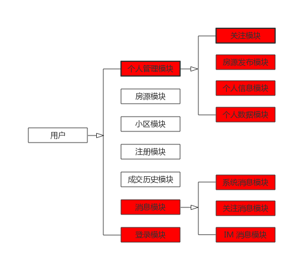
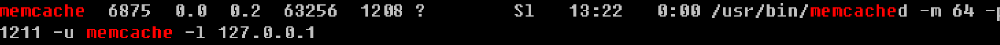

### 引言


### 1 绪论

#### 1.1 研究背景及意义

随着国家经济水平的高速飞展，带来了几个明显的变化：

- 大城市越来越多，工作机会也处于井喷阶段，越来越多的年轻人涌向大城市，大城市的住房情况越来越严峻。
- 城市居民的生活水平越来越高，每个家庭对于居住的环境、品质有了更高的要求。
- 房地产作为国家的支柱产业，越来越多的居民住宅被开发出来。

由于上述的几个原因，出现了很多房地产中介公司，据统计，在北京链家的员工数已经有几十万人，在大街小巷，随时能够看到骑着电动车的中介人员，也就是说房地产中介这个行业非常的有代表性，代表国家经济水平的发展。

房地产中介公司为了提高业务规模，公司内部多多少少都有一套房屋中介管理系统，房屋中介管理系统质量、功能的高低直接决定了公司的发展，而大大小小的房地产中介公司，其内部是如何运作，也是非常重要的一个话题。

对于国家、个人来说，了解房地产中介这个行业非常重要，能够间接反映一个国家的发展水平和信息化水平。

作为一个房屋中介信息公司，具有自己独特的网站将有利于公司的长足发展，也是进一步提高自己业务的必要手段和方法。网上信息化与现实业务的结合，更有利于调查了解顾客的具体需求，也节约了公司在各方面的一些开支。

从另外个角度看，随着互联网的越来越流行，信息化程度越来越高，是否能够借助互联网来提高房屋中介业务的发展，这是非常有趣的一个研究课题，在其他行业，已经充分证明了互联网信息技术对传统行业、传统行业运作模式的冲击。

#### 1.2 国内房地产中介业务现状

随着我国市场经济体制的确立和发展，如果能够选择一个好的房屋中介管理系统，把大量繁杂的、看似毫无关系的数据，有机的结合起来，形象的反映出市场的供求关系，就能够为得出正确的决策做出事半功倍的效果。

在过去，房地产中介在开展业务的时候，还是非常原始的一种工作模式，主要由人手工处理。

对于房地产中介来说，需要工作人员在某个地区搜集出租需求，然后手动录入到自己的系统中，这个系统可能就是一个 excel 文件，或者是简单的一个 C/S 系统，在录入的过程中，非常的繁琐，很容易出错，出错后又不易修改，信息管理效率低下，无法保证高质量的信息服务，难于快速满足客户的需求，在无形中就消耗了更多的时间，人力，物力，增加了房屋中介公司的运营成本。

所以对于大部分房屋中介公司来说，有必要建立房屋中介管理系统，使管理工作规范化，系统化，程序化，避免的随意性，提高信息处理的速度和准确性，能够及时、准确、有效的查询、修改房源基本信息，并能根据用户的不同需要，准确，迅速找到合适的房屋，而且管理者也迅速的统计出本月房屋出租出售情况等，对于用户的要求能够及时的满足，提高中介的工作效率。

而从用户的角度来看，在过去，一个用户如果想租房或者交易二手房，很难有一个途径找到自己需要的房子，或者购买心怡的房子。唯一的途径就是从朋友、亲戚，或者熟悉的中介了解一些信息，非常耗费自己的时间和精力，而且由于信息的不透明，很容易受到陌生人的欺骗，导致自己的财产受到损失。用户遇到很多黑中介的原因就在于大部分房屋中介公司没有一套完整的房屋中介管理系统。

所以不管从那个角度看，目前大部分国内房屋中介公司的发展，还处于一个很初级的阶段。

可喜的是，目前一些大型，比较成熟的房屋中介公司，比如链家、我爱我家等公司信息化发展水平已经比较高了，确切的说，这些公司已经有了一套成熟的“房屋中介管理系统”。

而本论文的宗旨就是实现一套类似的系统，定位于一个能够满足数据库管理软件，即具备一个数据库管理软件的基本功能，包括数据的增加，删除，修改，查询，统计等，便于用户查看，操作，和查询房屋登记信息。同时能够提供高质量的套打及快速生成统计分析报表。此外，系统具有用户登录功能，不同用户有不同的权限，这样可以提高数据的安全性和可靠性。该系统符合各房屋中介公司和各地房管局规定的各项数据项上报汇总统计的要求。系统采用盟友系统开发平台和数据库相结合的手段进行开发，结构紧凑、运行速度快、操作简单，更因为拥有自己的源代码，所以保证了软件具有高度的保密、安全性。

#### 1.3 论文主要内容

本论文除了开发出“房屋中介管理系统”，更重要的是我近几年计算机理论知识的一个总结和实践，通过这个系统，我掌握了软件的基本分析、设计、实现、测试方法论，从而具备了一定的软件开发技能，本论文主要包含了以下的一些内容。

1）利用软件工程和面向对象的思想和方法分析需求、进行系统架构的设计，对需求进行抽象分析，分析出其中的重要点，然后利用一些系统图设计软件（比如 ProcessOn）将画出整个系统架构图，和每个模块的流程图。

2）随着互联网的流行，基于 HTTP 协议的应用越来越多，互联网 B/S架构应用的越来越多，本论文核心就是实现一套 B/S 架构的管理系统，理解 B/S 架构的本质非常重要，核心就是理解 HTTP 协议，理解浏览器和服务器各自的角色。

3）每一套系统都需要部署，传统的 C/S 架构一般部署在单机上，安装方式和软件是紧密绑定在一起的，而对于 B/S 系统来说，任何一台电脑、手机设备，只要有浏览器就能访问 C/S 架构中的服务器。服务器是一种比普通电脑性能更强劲的电脑，需要托管在 ISP 的机架上，所花费的费用也是比较高的，因为需要购买服务器，还需要由机架的托管费用，更需要支付网络带宽费用。

而现在的云服务器厂商越来越多，服务器的部署也越来越方便，价格也越来越多，互联网开发的成本逐步降低，所以了解云厂商的产品也是学习的重点。

4）和其他系统一样，“房屋中介管理系统”重点就是开发服务器的软件，而选择服务器软件非常重要，服务器软件和操作系统是一一绑定的，需要一并考虑。

互联网开发中，非常重要的一个点，就是使用开源软件，开源软件的稳定性、性能都有保障，因为世界上很多聪明的人都在研究这些开源哪软件，更重要的是选择开源软件是免费的。

现在主流的互联网开发， 都运行在 Linux 操作系统上，选择 Windows 操作系统的并不多了，掌握一定的 Linux 基础知识非常重要，比如了解基本的命令，了解网络配置，了解基本的 Shell 脚本，了解常见的软件安装方法。

而服务器的选择就更多了，在互联网系统中，比较常见的就是 Apache、Nginx，理解服务器的特点非常重要，服务器软件就是 B/S 架构中的 S，实现了 HTTP 协议的所有功能。

5）互联网系统中，另外一个非常重要的单元就是数据库，数据库主要用于数据的存储、查询、更新、维护。主要涉及两方面，分别是 SQL 语言，SQL 语言主要对数据库表进行查询、更新，是一种比较通用的语言。

另外一方面就是数据库管理系统，比如 Mysql、Sqlserver、PostgreSQL、Oracle，数据库系统除了提供数据查询、更新，还负责数据的完整性、安全性。

互联网开发中，选择一个数据库系统非常重要，可以选择收费的（Oracle、Sqlserver），也可以选择免费的系统（比如 Mysql、PostgreSQL）。

为了更好的设计数据库表结构，和抽象理解数据库表之间的关系，可以使用 E-R 图来描述，在开发这套系统的时候，我就是使用 E-R 图来描述数据库表。

6）互联网系统中，主要在服务器上部署代码，代码用于输出 HTML 语言，浏览器主要是解析 HTML 语言，基于互联网的 Web 开发技术有很多知识点，比如 CSS、JavaScript、HTML，这些技术主要是浏览器负责解析。

7）互联网开发中，最重要的就是选择一个开发语言，他们负责从数据库中查出数据，然后根据业务逻辑输出 HTML 页面，开发语言有很多，而我们学习计算机技术，最重要的就是选择一门语言，语言有高级语言，比如 C、C++，也有一些动态语言，比如 Java、Python、Go、ASP、C#、PHP，这些语言各有特点，但都有一个共同点，都是面向对象的开发语言，基于他们能够开发出很多系统。

在开发房屋中介管理系统中，最终选择的是 PHP 开发语言，这个语言有着很多的特点和优点。

8）每个语言都有很多的开发框架，开发框架是为了更好的进行开发，有着很多优秀的库，开发框架对于的是一种开发模式，比如 MVC 模式。

对于 PHP 语言来说，有很多的开发框架，比较流行的像 laravel、symfony、CodeIgniter，CakePHP等等。

9）开发语言和开发框架都是为了更好的进行开发，但最重要的是程序代码的开发，选择合适的开发模式非常重要，而为了更好的进行全盘理解，可以使用 UML 语言来描述各个模块之间的关系，UML 和 OOP 是紧密关联的。

### 2 需求分析

需求分析是软件开发中最重要的一环，只有了解业务产品的需求，对这些需求进行可行性分析后，才能全面了解是否有必要开发互联网系统。

#### 2.1 可行性分析

1）必要性分析

随着社会发展的加快，对一个软件系统的要求也就越来越高。任何一个软件系统都可能受时间和资源的限制，为了避免盲目投资，减少不必要的损失，即以最小的代价在最短的时间内确定该项目是否值得开发，所以，必须进行需求分析， 编写需求分析报告。能将项目开发的风险降到最低。

2）技术可行性分析

根椐对本系统中所用到的技术架构的掌握，以及相关硬件和开发软件的支持，以计算机网络作为信息传输媒体，信息传送速度快、信息覆盖面广、成本低的特点。因此，很多个人或企业都开始得用网络开展商务活动，可以看到，在个 人或者个业进行网上商业活动时间产生的是多方面的。但是，开发任何一个基于计算机的系统，都会受到时候和资源上的限制。因此，对在接受任何一个项目开 发任务之前，必须根据客户可能提供的时间和资源条件进行可行性分析，以减少项目开发风险，避免人力、财力和物力的浪费。可行性分析与风险分析在很多主面是相互关联的，项风险越大，开发高质量的软件的可行性就越小。

在进行技术分析的时候，以下几点非常重要：

（1）房屋中介管理系统的数据量非常的大，随着时间的推移，系统会积累越来越多的房源信息，数据库的存储是否能够横向的伸缩非常重要，而且随着时间的推移，数据查询的性能是否有保障也非常的重要。

（2）房屋中介管理系统的业务需求是多样化的，未来有新的需求提出的时候，这套系统的架构设计是否有足够的弹性非常重要，如果有了新的需求，而系统要如果进行全方位的重构，那说明这套系统的设计存在问题。

（3）系统技术的实现是否能够真正帮助中介公司的员工以及用户，一套完整的系统应该能够尽量的自动化，客户应该能够无障碍的使用，如果系统设计的是半自动化，那么会影响效率。

（4）需要综合考虑系统的开发成本、维护成本，对于一个房屋中介公司来说，一方面需要考虑系统的开发成本、搭建成本、二次开发成本、后期维护成本，需要考虑综合的成本，并评估该系统带来的收益，比如业务的增长情况、员工的减少，只有确定收益是正向的，才能考虑项目的可实施性。

当然现在已经进入了信息化的世界，每个基于互联网用户的企业一般情况下都需要构建一个管理系统，只是在产品和技术层面，需要找到一个平衡点。

#### 2.2 产品需求分析

任何一套系统都是基于产品需求才开发出来的，在房屋中介管理系统中，产品需求非常繁杂，所以需要从多个角度进行分析，然后才能更好的进行系统设计和系统开发。

1）房屋中介管理系统的各个角色

在房屋中介管理系统中，主要有三个角色，这三个角色系统功能大不相同。

（1）租房和买房用户

对于这类用户来说，最重要的功能就是快速找到房源，而且房源越多越好。

使用这套系统的最主要功能如下：

- 使用多种途径查询符合自己需求的房屋，也就是能够快速找到房源。
- 对于找到的房源进行多方面比较，比如说从价格、房屋大小、房屋设施进行多方面比较。
- 能够对心怡的房屋进行管理，比如可以收藏房源。
- 了解房屋交易的一些情况，比如国家是否出现了一些新的房产税。
- 能够就某一个房源和中介在系统中进行沟通，了解详细的情况，也就是说除了手机，多了一种途径直接和中介公司进行沟通。
- 大数据分析需求，比如了解某个小区房屋历史的出租、售卖房屋的价格。

（2）出租和售房用户 

对于这类用户来说，就是多了一个可信的平台发布自己要出租或者售卖的房子，主要功能如下：

- 系统支持发布出租或者出售的房源。
- 一旦发布的房源结果中介公司审核通过，房源的信息主要由中介公司进行管理，出租（出售）的用户无法和租房（购房）的用户直接沟通。
- 了解目前房屋出租和售卖的一些市场行情，更好的选择出租（售卖）价格。

对于这类用户来说，其所有完成的功能，必须通过身份认证，称为该系统的用户，主要是为了保障用户安全性，房屋数据的安全性。

（3）房屋中介公司

房屋中介公司是租房（出租）用户和购房（售房）用户之间的一个桥梁，构建了一个平台，方便用户之间互相了解信息，然后以优质的服务促成双方完成交易，交易完成会收取服务费，这应该是中介公司最主要的收入来源。

同时房屋中介公司最核心的资源就是房源数据和成就数据，有了这些数据，中介公司可以更好的了解目前的房屋市场行情，从而进行业务重心的调整。

对于房屋中介公司来说，其主要的功能包括：

- 发布最新的新闻，包括国家最新的法律法规，市场的一些行情，一些专业的分析。
- 寻找尽可能的多的房源，然后征求出售（出租）用户的意见，将相关的房源录入到系统中。、
- 发布、更新、删除房源信息。
- 审核出售用户提交的房源信息，如果审核通过，可以选择发布到系统中。
- 管理各个地区的房源信息。
- 对成交的房源进行系统更新，比如更新房屋出租、出售的价格。
- 对于成交的房源，进行合同的更新，但出现交易纠纷的时候，可以有效的保障双方的权益。

2）功能需求

从不同角色了解产品需求后，也可以从模块的角度了解产品需求，从而更好的理解业务需求，并为后面的技术分析和技术实现打好基础。

（1）房源的筛选功能。

对于租房（二手房购买）用户来说，这是最重要的功能。

而为了找出合适的房源，多维度查找房源非常重要，比如可以根据小区、户型、租金（房屋价格）、房屋朝向、时间查找符合的房源。

对于房屋中介公司来说，大量而精准的的房源数据是其核心的企业竞争力。

（2）快捷的房源发布功能

对于传统的房屋中介系统来说，录入房源是非常繁琐的工作，而智能化的系统能够更加方便中介公司员工录入系统，比如：

- 可以根据手机定位，快速的定位小区
- 使用手机的摄像功能，能够快速拍摄房屋的照片。
- 可以使用本小区其他的房源信息快速生成一条新的房源信息。

而对于出租出售房屋的用户来说，可以多了一种途径发布房源信息，极大的节省了时间，对于传统房屋中介系统来说，出租出售房屋的用户需要去中介公司登记房源，然后中介公司人员去用户的住宅登记信息，最终再录入到系统中，这个过程非常耗时，而且耗费所有人的精力。

（3）完善的保障系统

中介公司不仅仅是售卖房屋（出租房屋）用户之间的桥梁，更要保障双方的权益，不管是房屋出售还是房屋租赁，都有完整的合同约束双方，当出现纠纷的时候，能够保障双方的权益。

对于二手房出售来说，为了保障购房、买房、中介公司的利益，更需要有完整的流程来保障，流程虽然不能以系统功能的形式提供，但也是系统中的一部分。

（4）IM 功能 

对于传统的房屋中介系统来说，这三个角色用户之间沟通方式除了在中介公司的门店，其他就是通过手机联系，而手机联系的劣势就是无法说清楚很多情况，比如电话的过程中，中介公司员工无法向用户展示房屋的信息，不能很好的进行沟通。

而集成在房屋中介管理系统的 IM 功能，客户可以无障碍的和中介公司员工进行沟通，了解详细的房源情况。

每个小区的房源由特定的中介公司人员维护，了解每个小区的具体情况，通过 IM 功能，客户能够向最了解情况的中介公司员工了解情况。

（5）消息功能

对于房屋中介管理系统来说，它不仅仅满足用户在某个时间寻找房子，更是用户长期关注二手房、租房非常好的一种途径，了解垂直领域非常好的方式。

对于用户来说，如果对某个小区、某个房源感兴趣，如果这个小区有新的租房、二手房房源增加，或者这个房源的价格减价，都会通知关注的用户。

（6）统计功能

对于这套系统来说，最主要的用户就是中介公司人员，系统的好坏、功能的完善程度都会影响员工的工作效率，除了效率，这个功能还会帮助中介公司决策。

比如能够统计：

- 每天房屋成交量
- 每天新上出租房数量
- 每天新上二手房数量
- 每天看房数量
- 每天咨询数量
- 每个地区、每个房源相关的数据量（比如咨询量、成交量）。 

有了这些决策，中介公司可以有针对性的进行业务调整。

#### 2.3 系统功能需求

除了对业务的需求进行分析，也有其他方面技术性的需求，这些都是非常重要的，如果对这些需求了解的不够，会直接影响用户的体验，和中介公司员工的工作效率。

1）性能

对于这套系统来说，性能非常重要，用户可能会在某个时间段内集中使用，使用多种筛选方式寻找自己合适的房源，如果系统响应非常缓慢，用户的感受会非常不好。

2）多平台支持

对于用户来说，使用这套系统的主要设备就是手机，因为用户找房的时候，查询到合适的房源，一般会直接到中介公司的门店了解情况，所以手机设备使用这套系统非常重要。

对于“房屋中介管理系统来说”，主要的平台就是 PC 电脑和手机，而为了兼容性考虑，手机上主要是 HTML5 页面，而没有直接使用手机 APP。

手机 HTML5 页面功能和手机 APP 功能类似，体验也差不多，而最大的好处就是避免开发不同平台的 APP（i	Phone 和 Andriod），因为开发 APP 的成本非常高，在我开发这套系统的时候，没有进行原生的 APP 开发。

如果确实需要手机 APP，可以直接开发一个外壳程序，其中嵌入 HTML5 页面，也能完成一个 APP 的功能，这是 HTML5 的最大优势，跨平台性非常好。

3）安全性

任何一个系统，大家都会忽略安全性，而一旦出现安全问题，就会意思到安全的重要性，安全能够极大保护用户的隐私。

在开发这套系统的时候，所有提供的服务都有 HTTPS 协议保持。

4）稳定性

一般情况下，性能和稳定性是一起考虑的，某些系统如果访问量相对平稳的情况下，性能和稳定性都相对有保障，而一旦遇到访问高峰，则性能会直线下降，而稳定性也会出现问题，比如待机。

本论文使用多种手段，解决稳定性和性能的问题。

### 3 系统设计

系统设计是需求分析和技术实现之间的桥梁，对需求进行抽象分析，从整体上设计出系统的架构图，然后再设计每个模块，最后将各个模块之间串联起来。

而为了实现这个系统，必须了解一些关键的技术，这些是系统的骨架，也是系统功能需求完善最重要的因素。

#### 3.1 B/S 架构 

1）C/S 架构

在互联网还没有处于井喷阶段，软件主要采用 C/S 架构。

C/S 架构全称就是客户端（Client）和服务器（Server）架构，它的出现是有特定原因的，在互联网早期，大型的服务器并没有出现，所以这种架构主要充分使用客户端和服务器端的功能，服务器端主要是数据库连接操作，大量的业务逻辑操作主要由客户端完成。

在 C/S 架构流行的阶段，HTTP 协议还没有流行，并没有统一的标准进行数据的通信，C/S 架构更像一种单机软件，也没有分布式概念。

传统的 C/S 架构比较适合于在小规模、用户数较少、单一数据库且有安全性和快速性保障的局域网环境下运行，所以得到了广泛的应用。

C/S 架构的升级更新也非常困难，可能还需要在特定的机器下运行，比如现在很多企业的软件还只能在 Win XP 系统下使用，而微软早已宣布不在维护 XP 系统，可见这些 C/S 软件的安全性也非常严峻。

2）B/S 架构

随着互联网的流行，出现了一些新情况：

- HTTP 协议的崛起，HTTP 协议是软件开发有了标准的通信标准，基于 HTTP 协议的开发越来越多。
- 随着千家万户接入了互联网，传统的企业软件不再是这个市场上唯一的软件，更多的软件出现了，比如生活类软件、新闻类系统也初步出现，而 C/S 架构是不能满足这种软件开发。
- 有了互联网，用户期望有一种简单的方式获取信息，基于 HTTP 协议产生的浏览器使用越来越规范，浏览器更像机器的操作系统，任何一台设备（PC 电脑、手机）都能获取到服务。
- 分布式系统的流行，单机系统的性能已经不能满足信息化的需求，而分布式系统对于系统的可扩展性、性能意义重大。
- 在 Web 2.0 时代，越来越多的用户使用手机设备替代电脑设备，这是一个新的软件需求形式。

基于以上的原因，B/S 架构越来越流行，可以说目前大部分互联网系统软件都采用这种架构进行开发。

B/S 架构（Browser/Server，浏览器/服务器架构），是 Web 兴起后的一种网络结构模式，Web 浏览器是客户端最主要的应用软件。这种模式统一了客户端，将系统功能实现的核心部分集中到服务器上，简化了系统的开发、维护和使用。客户机上只要安装一个浏览器 ，比如 IE、Chrome、Firefox、Edge。

B/S 架构的另外一端就是服务器，目前有很多软件实现了服务器，比如 Nginx、Apache 等等，这些服务器软件主要就是实现 HTTP 协议，一般情况下绑定默认的 80 端口，然后监听客户端（浏览器）的请求。

那么 B/S 架构相对 C/S 架构有那些区别呢？

（1）对于 C/S 架构来说，原先客户端的任务非常繁重，完成核心的业务逻辑，而对于 B/S 架构来说，客户端的任务相对减轻，主要由服务器完成逻辑处理，数据处理。

但互联网技术发展到现在，从应用的角度来看，目前也逐步重客户端的开发，这得益于 HTML5、JavaScript、CSS 技术的发展，这三个技术目前是 Web 技术中的核心组成部分。重客户端技术的发展和互联网的发展是同步的。

手机设备越来越多，几乎人手一部手机，而手机设备上的资源越来越多，比如摄像头、定位、相册，为了更好的使用一个系统，这些设备能力以一种抽象的方式提供，这些也促使了 HTML5 技术的发展，HTML5 技术是 HTML 技术的下一代标准。

而为了使用这些设备能力，为了使用 HTML5 技术，JavaScript 是最重要的一个桥梁，通过 JavaScript 语言，能够丰富客户端的操作，而执行 JavaScript 语言的容器就是浏览器，也正因为此，像谷歌、Mozilla 这样的大公司在不断的推进浏览器、JavaScript的研究。

（2）双方运行的环境不一样

C/S 架构主要在局域网使用，主要 C/S 架构盛行的时候，那时候 TCP/IP 技术还没有大规模的使用。

而 B/S 技术，只要有互联网，就能使用，现在每家每户都能接入宽带，上网已经非常普遍了。而且手机移动互联网也非常繁荣，B/S 技术已经进入了很好的切入点。

（3）安全性

对于 C/S 架构的软件来说，运行环境一般是企业内部，企业内部网络一般由防火墙保护，如果防火墙安全级别足够高，那么倾入者很难对内部系统发起攻击。

而基于 B/S 架构的应用软件或者系统来说，安全问题非常严峻，最主要的原因就是互联网模型的问题，HTTP 协议的底层协议是 TCP 协议，而 TCP 协议不维护通信数据的安全性。

为了在协议层保证系统的安全性，“房屋中介管理系统”可以使用 HTTPS 协议来提供数据服务。 

（4）开发模式的变更

传统的 C/S 架构软件，主要使用高级语言编写，比如 C++，这些语言数据处理和呈现是在一起的。

而对于 B/S 架构的软件来说，主要使用动态语言开发，比如 Java、Python、PHP、Go，动态语言相比高级语言开发的效率、质量都更有保证。

而从软件开发模式的角度考虑，C/S 软件主要使用 GUI 模式。而B/S 软件主要采用 MVC、MVP 模式的软件开发模式。

（5）系统维护方式不一样

对于 C/S 软件来说，系统的开发者就是系统的维护者，出现问题一般和运行软件的系统关系不大。

而对于 B/S 架构的软件来说，情况复杂的多，一个完整的系统（比如房屋中介系统）由多个单元构成，比如浏览器、HTML语言、JavaScript语言、后端开发语言、服务器，这些情况中和起来，排查问题非常困难。

#### 3.2 系统架构图

对于大部分互联网系统来说（比如论文描述的房屋中介系统），一般情况下使用 B/S 架构。在这个架构中，S 代表的不仅仅是服务器，对于有规模的系统（或者网站）来说，系统架构是非常复杂的。

系统架构包括网络结构和应用架构，网络架构就是系统是如何部署的，现在的系统一般情况下都是分布式的，都支持弹性可扩展。

下面这张图清晰了描述本论文开发的“房屋中介管理系统”的系统架构图。


<center>图3-1：系统架构图</center>

系统架构图中有以下几个组成部分：

1）HTML 请求

在 B/S 系统中，服务器大部分响应的就是 HTML 页面，HTML 页面由浏览器进行渲染，然后呈现给用户。随着 Web 2.0 技术的崛起，一个页面的组成并不仅仅是单个页面，页面还会引入其他的元素，比如图片、视频、JavaScript、CSS 等文件，Web 优化技术有很多。

2）API 接口 

API 开发模式越来越流行，比如服务器仅仅提供数据 API 接口，而应用方主要使用 API 接口开发各种业务，最普遍的就是手机 APP 开发，也就是手机软件开发者基于 iPhone 和 Andriod 平台开发软件，这些软件主要调用服务器端的 API 接口。 

对于系统提供者来说，不管 HTML 请求还是 API 接口，架构模型是一样的。

3）负载均衡设备 

在房屋中介管理系统中，Web 服务器不止一台，也就是说该系统支持分布式部署，而每台 Web 服务器的计算能力是不一样的，同时 Web 服务器也可能会出现故障，为保证系统稳定运行，需要使用负载均衡设备。

负载均衡（Load Balance）建立在现有网络结构之上，它提供了一种廉价有效透明的方法扩展网络设备和服务器的带宽、增加吞吐量、加强网络数据处理能力、提高网络的灵活性和可用性。

通过负载均衡设备，能够将请求分摊到多个 Web 服务器上进行执行。

负载均衡设备可以自行构建，比如 HaProxy 和 Lvs 都是负载均衡设备服务器。在开发房屋中介管理系统的时候，使用的是商业负载均衡设备，选择的云厂商是阿里云。

4）Web 服务器和应用服务器

Web服务器一般指网站服务器，是指驻留于因特网上某种类型计算机的程序，可以向浏览器等Web客户端提供文档。 

从广义的角度看，Web 服务器不仅仅接收客户的请求，也负责处理客户的请求，然后响应给用户。

而从细分的角度看，Web 服务器仅仅接收客户端的请求，然后将请求转发给后端的应用服务器，也就是说从逻辑上：

- Web 服务器和 Web 应用服务器是独立的，可以通过 FastCgi 协议或者 Proxy 的方式互相通信。
- Web 服务器和 Web 应用服务器可以是耦合的，比如对 PHP 语言来说，Apache 可以有 mod_php 提供 Web 应用服务器；

在发房屋中介管理系统中，使用 Nginx 作为 Web 服务器，应用服务器使用 PHP-FPM 管理器处理 PHP 语言逻辑，双方的逻辑关系如下图：


<center>图3-2：Nginx+PHP-FPM</center>

主要有三种方式连接 Web 服务器和 Web 应用服务器：

- Socket 方式，通过网络句柄的方式进行通信，Web 服务器和 Web 应用服务器是同一台服务器
- Fastcgi 方式，以 FastCgi 的协议进行通信。
- Proxy，以反向代理的方式进行通信。 

在发房屋中介管理系统，最终选用代理的方式（proxy_pass）进行通信。

5）数据库 

数据库(Database)是按照数据结构来组织、存储和管理数据的仓库，它产生于距今六十多年前，随着信息技术和市场的发展，特别是二十世纪九十年代以后，数据管理不再仅仅是存储和管理数据，而转变成用户所需要的各种数据管理的方式。数据库有很多种类型，从最简单的存储有各种数据的表格到能够进行海量数据存储的大型数据库系统都在各个方面得到了广泛的应用。

在互联网应用中，使用的数据库存储系统有很多，主要有两种：

（1）传统的数据库软件

比如 Mysql、PostgreSQL、sqlserver，这类数据库作用是数据存储，也称为关系型数据库，关系型数据库可以通过 SQL 语言，查询数据库表记录，更新表记录。

对于房屋中介管理系统来说，最重要的数据库表就是房源数据表，而筛选功能是该系统中最核心的功能，筛选条件非常多，对于关系型系统来说，大量没有索引的 sql 查询对数据库的性能有极大的影响，也就是说对于房屋中介管理系统来说，从筛选这个功能上来说，不适合使用传统的数据库软件。

不适合，并不代表传统数据库软件不能应用于房屋中介管理系统，可以使用 Memcached 这样的软件来缓解数据库的操作。

（2）Nosql 

NoSQL，泛指非关系型的数据库。随着互联网web2.0网站的兴起，传统的关系数据库在应付web2.0网站，特别是超大规模和高并发的SNS类型的web2.0纯动态网站已经显得力不从心，暴露了很多难以克服的问题，而非关系型的数据库则由于其本身的特点得到了非常迅速的发展。NoSQL数据库的产生就是为了解决大规模数据集合多重数据种类带来的挑战，尤其是大数据应用难题。

目前应用的比较多的 Nosql 软件就是 Mongodb 和 redis 。

最终房屋中介管理系统使用的数据库是 Mysql。

6）Memcached 

Memcached 是一个高性能的分布式内存对象缓存系统，用于动态Web应用以减轻数据库负载。它通过在内存中缓存数据和对象来减少读取数据库的次数，从而提高动态、数据库驱动网站的速度。Memcached基于一个存储键/值对的hashmap。其守护进程（daemon ）是用C写的，但是客户端可以用任何语言来编写，并通过memcached协议与守护进程通信。

Mmecached 特点如下：

1）Memcached 首先是一个缓存软件，也就是说它不会持久化存储数据。

2）它所有的操作都是基于内存的，所以非常快速，这是他最核心的优点 

3）基于libevent的事件处理，协议也非常的简单，每秒能支持几万个程序，这非常适合与房屋中介管理系统。

4）Memcached 也有客户端和服务器端，服务器端主要启动一个进程，提供查询更新操作。

而各个不同语言，都有对应的客户端扩展，使用起来非常方便。

房屋中介管理系统也使用了 Memcached 软件，主要是为了缓解后端数据库的压力。Memcached 使用效果好坏的评估标准就是缓存命中率，也就是缓存命中次数/总请求次数。

#### 3.3 LNMP 平台介绍

系统架构能够清楚表达中介管理系统是如何搭建的，但最终为了实现该系统，需要编写代码，应用架构非常重要，在中介管理系统中，最终使用 LNMP 平台部署代码服务。

换个角度说，应用架构和网络架构互相独立，但也互相关联。不管选择的是什么平台（LNMP还是LAMP），对于软件开发者来说非常重要。

LNMP指的是一个基于CentOS/Debian编写的Nginx、PHP、MySQL、phpMyAdmin、eAccelerator一键安装包。可以在VPS、独立主机上轻松的安装LNMP生产环境。

LNMP代表的就是：Linux系统下Nginx+MySQL+PHP这种网站服务器架构。

可以看出，上述这些软件都是免费的，这是互联网系统开发的特点之一。

1）Linux

Linux是一类Unix计算机操作系统的统称，是目前最流行的免费操作系统。

代表版本有：debian、centos、ubuntu、fedora等。房屋中介管理系统选用 Ubuntu 操作系统。 

当然这套系统部署在其他操作系统上也完全可以，也就是开源软件有个最大的好处就是标准，移植性非常好，而且对于房屋中介管理系统来说，运行在什么样的操作系统上并没有太大的关系，大部分的开发语言和 Web 服务器、Web 应用服务器关系比较大。

2）Nginx 

房屋中介管理系统使用 Nginx 作为 Web 服务器，其也是一个开源软件，目前已经超过 Apache ，成为全球最大的 Web 服务器。 

Nginx  是一个高性能的HTTP和反向代理服务器，也是一个IMAP/POP3/SMTP服务器。Nginx是由伊戈尔·赛索耶夫为俄罗斯访问量第二的Rambler.ru站点开发的，第一个公开版本0.1.0发布于2004年10月4日发布。

其将源代码以类BSD许可证的形式发布，因它的稳定性、丰富的功能集、示例配置文件和低系统资源的消耗而闻名。 

Nginx是一款轻量级的Web 服务器/反向代理服务器及电子邮件（IMAP/POP3）代理服务器，并在一个BSD-like 协议下发行。其特点是占有内存少，并发能力强。

3）PHP 

房屋中介管理系统采用 PHP 语言，也就是论文第四部分系统实现阶段，主要选用 PHP 语言进行开发。

PHP 是一种开源的通用计算机脚本语言，尤其适用于网络开发并可嵌入HTML中使用。PHP的语法借鉴吸收C语言、Java和Perl等流行计算机语言的特点，易于一般程序员学习。PHP的主要目标是允许网络开发人员快速编写动态页面，但PHP也被用于其他很多领域。 

PHP 特点也非常多：

（1）跨平台，性能优越，虽然是一门解释型语言，但是执行效率非常高。

（2）语法简单，如果有学习C和Perl的很容易上手，并且跟ASP有部分类似。有成熟的开发工具，比如 Netbeans、Sublime Text。 

（3）目前主流技术都支持，比如WebService、Ajax、XML等等，足够应用。

（4）有比较完整库和函数的支持，比如使用ADODB或者PEAR::DB做数据库抽象层，用Smarty或者smart template做模板层。

（5）有很多成熟的框架，支持MVC的框架包含 Laravel、Symfony2、CakePHP、CodeIgnlter 等等。

（6）PHP 5已经有成熟的面向对象体系，能够适应基本的面向对象要求。适合开发大型项目。

（7）有成熟的社区来支持PHP的开发。

（8）目前已经很多大型应用都是使用PHP

 4）Mysql 

 Mysql 是一款开源的数据库管理软件，也是使用量最大的免费数据库软件。

 MySQL在过去由于性能高、成本低、可靠性好，已经成为最流行的开源数据库，因此被广泛地应用在Internet上的中小型网站中。随着MySQL的不断成熟，它也逐渐用于更多大规模网站和应用。 LNMP 中的 M 代表的就是 Mysql。 

 Mysql 特性如下：

（1）使用C和C++编写，并使用了多种编译器进行测试，保证源代码的可移植性。

（2）支持的平台非常多，比如支持 Windows、Linux、FreeBSD、Mac OS 等 

（3）为多种编程语言提供了API，比如 Java、Python、PHP、Go。

（4）支持多线程模式，能够保证一定的查询性能。

（5）提供TCP/IP、ODBC和JDBC等多种数据库连接途径。

（6）可以处理拥有上千万条记录的大型数据库。 

#### 3.4 混合开发模式 

互联网发展到现在，很多系统不仅仅提供一个网站，大部分网站都有一个 APP，APP 的成熟发展源于手机设备越来越多，而 APP 开发模式和网站开发模式，从一定程度上来看是不一样的。

1）网站开发和 APP 开发的区别。

网站开发主要来看包含两部分，分别是服务器端代码的开发（房屋中介管理系统使用的是 PHP 语言）和客户端语言（JavaScript）的开发，服务器端语言生成 HTML 代码，不管是 HTML 代码还是页面中嵌入的 JavaScript 代码，最终都是由浏览器渲染的，但是核心逻辑都是有服务器端处理的（客户端的 JavaScript 代码也是服务器端控制的，只是运行在客户端）。 

而对于 APP 开发来说，有显著的几个特点：

（1）APP软件开发指的是手机应用软件的开发与服务。

（2）APP 软件运行不同的平台，目前主要的是 iPhone 平台（这是一个闭源的平台）和 Andriod 平台，每种平台都有自己的开发语言，可以看出开发一个 APP ，相比网站开发来说，还需要增加一种开发语言。

（3）APP 平台语言完成的功能和服务器动态语言（比如 PHP ）差不多，比如有相同的语法结构、开发模式，唯一不同的是 APP 运行环境是手机设备，而手机设备目前的功能已经非常成熟了（相当于一个小型的 PC 电脑），APP 平台语言提供了对手机设备功能的抽象，提供了访问手机设备的接口，
 
（4）APP 平台语言也可以嵌入一个浏览器，浏览器可以执行相同的网站功能，这就是混合开发模式 。 

2）混合开发模式

网站开发的模型可以参考下图：

 

<center>图3-3：网站开发的模型图</center>

从上图看出，浏览器最终渲染的 HTML 页面仍然是由服务器控制的，服务器除了从数据库查询数据，还要负责生成最终的页面，浏览器只是辅助，最多执行一些客户端的功能。

原生 APP 开发模型如下图：


<center>图3-4：原生 APP 开发模型如下图</center>

从上图看出，服务器主要负责 API 接口的输出，其他逻辑主要由手机 APP 完成（并不是说 Web 服务器没有业务逻辑）。

而手机 APP 的运行宿主只能是手机设备，而且只能是特定的手机设备，系统的可移植性相对较差。

在完成房屋中介管理系统的时候，考虑到很多用户都在户外通过手机使用系统，所以说一个 APP 是比不可少的。

当然有些用户也觉得下载 APP 成本过高，或者只是临时使用下系统的功能，也可以在手机浏览器中使用房屋中介管理系统，但是体验比 APP 差了很多（当然使用 HTML5 技术不会出现这个问题）。 

而为了实现一套系统，如果也要采用原生 APP 开发，复杂度非常高，还要学习手机 APP 的开发。那么有没有更快速的解决方法呢？

考虑到 APP 也可以嵌入浏览器，那么是否 APP 直接可以嵌入一个网站，运行模型如下图：


<center>图3-5：混合开发模式</center>

可以看出不管是 PC 访问的网站，还是 APP，都使用浏览器加载网站内容，这个 APP 完成的功能非常简单，没有很复杂的开发工作，仅仅通过编码，在 APP 中嵌入一个 HTTP 网站即可。

也就是说只要开发一个网站即可，既能提供 PC 访问，还能以 APP 的形式供手机使用。目前国内很多公司都采用这种混合开发模式。

房屋中介管理系统最终也采用这种开发模式。 

#### 3.5 HTML5 技术 

混合开发模式随着 HTML5、HTTP/2 技术的发展才逐渐成熟。

主要原因：

1）手机设备有很多 PC 并不具备的功能，比如定位、摄像头等等，而传统的 HTML 标准无法获取到手机设备的这些功能，也就是说如果采用混合开发模式，手机 APP 很多功能无法使用。

2）传统的 HTTP 协议也有很多问题，比如没有消息推送功能。 

3）HTML 技术在手机 APP 和 PC 浏览器中呈现是不一样的，需要做一定的社配。

而 HTML 5 技术的出现，打消了这些疑惑，使用该技术，混合开发模式开发出来的 APP 和原生 AP 并没有太大的差别。 

HTML5 语言标准是应用超文本标记语言（HTML）的第五次重大修改，相当于 HTML 语言的升级版本，目前大部分主流的浏览器都支持该标准，比如 Chrome、Firefox、Safari、Opera、IE、Edge，也就是说已经进入大规模使用阶段。

HTML5 语言的本质就两点：

- 它是一个新版本的HTML语言，具有新的元素，属性和行为。
- 它有更大的技术集，允许更多样化和强大的网站和应用程序。 

HTML5 标准从模块的角度看，主要分为几点：

- 语义：能够让你更恰当地描述你的内容是什么。
- 连通性：能够让你和服务器之间通过创新的新技术方法进行通信。
- 离线 & 存储：能够让网页在客户端本地存储数据以及更高效地离线运行。
- 多媒体：使 video 和 audio 成为了在所有 Web 中的一等公民。
- 2D/3D 绘图 & 效果：提供了一个更加分化范围的呈现选择。
- 性能 & 集成：提供了非常显著的性能优化和更有效的计算机硬件使用。
- 设备访问 Device Access：能够处理各种输入和输出设备。

和 HTML5 紧密关联的一个技术就是 HTTP/2 协议，HTTP/2 协议是下一代的 HTTP 协议，服务器为了支持 HTTP/2 协议，首先名支持 HTTPS 协议，HTTPS 协议只是在 HTTP 协议上加了一个 SSL 层，本质上可以认为是 HTTP 协议。

HTTP 协议、HTTPS 协议、HTTP/2 协议关系如下：

- HTTP/2 协议是下一代的 HTTP 协议，目前主流的 HTTP 协议版本是 HTTP/1.1 
- HTTPS 协议基于 HTTP/1.1 协议和 HTTP/2 协议都可以，只是在这两个应用层协议之上加了 SSL 层。 

HTTP/2 协议主要有以下几个优点：

- 性能更高，支持双向传输，并行处理
- 支持服务器端的推送功能，无须只用 websocket 技术来实现，这个功能结合 HTML5 技术非常重要。
- 数据压缩，能够有效减少数据传输量
- 对数据传输采用多路复用，让多个请求合并在同一 TCP 连接内。

在开发房屋中介管理系统的时候，最后采用了 HTML5 技术和 HTTP/2 技术，不管是手机 APP 的访问，还是网站的访问，最终服务器输出的都是 HTML5 页面，由于手机设备和 PC 设备大小不一样，用户体验也不一样，最终生成的页面并不相同，但都符合 HTML5 标准。

#### 3.6 系统模块设计

系统模块设计是对需求的一个抽象理解，也是论文的关键部分，清晰的模块对于房屋中介管理系统的开发也是至关重要的。

房屋中介管理系统主要包含两部分房产需求：

- 租房需求
- 二手房需求

这两者在功能上有一定的共性，为了更清楚的介绍，主要针对租房功能进行描述。接下去的技术实现也主要实现租房需求功能。

房屋中介管理系统主要供两部分人员使用：

- 中介公司员工，角色分为两种，超级管理员和管理员，每个模块都已经配置为权限，超级管理员可以创建管理员和分配权限。
- 用户，用户分为租房用户和出租房用户，双方在功能上并没有太大的区别。 

房屋中介管理系统主要分为两个系统，双方之间从功能上是独立的，在技术实现上紧密关联的。

系统分为两个核心系统：

- https://www.house.com，主要供客户使用
- https://admin.house.com ，主要供中介公司员工和管理员使用。

1）用户功能模块

用户主要访问 www.house.com 网站（APP 嵌入的也是该域名的 HTML5 页面内容），模块关系如下图：



<center>图3-6：www.house.com 模块关系</center>

其中标红的模块需要用户登录才能使用。

（1）登录模块

登录模块，非常简单，使用消息模块、个人管理模块、消息模块，都需要登录。

主要通过用户手机号和密码进行登录。

（2）注册模块

注册模块也非常简单，客户如果想使用更多的功能，可以注册成为房屋中介管理系统的用户。

（3）房源模块

这个模块是整个系统中最核心的模块，用户 90% 的操作就是使用该功能，房屋中介管理系统可以通过多种筛选方式找出合适的房源。

需要注意的是，用户使用该功能之前，需要先选择城市，也就是说所有的房源在某个城市下面。

筛选的条件非常多，比如：

- 根据小区搜索
- 根据地铁线路搜索
- 根据租房区间价格搜索
- 根据户型搜索
- 根据租房方式搜索，比如可以选择整租或者合租
- 根据房源其他情况进行搜索，比如户型、有无地铁、朝向等等。 

（4）小区模块 

可以了解某个小区的房源信息，比如可以知道小区的具体情况，交通、地理位置、绿化。

也可以了解该小区目前可出租的房源数，历史出租成功数量。

（5）历史成交模块

可以了解某地区、某小区相关情况的成交记录，这个功能模块是非常重要的功能，是了解某个地区租房情况的风向标。

（6）消息模块

在房屋中介管理系统中，集成了一个消息功能模块，主要包含三个子模块：

- 系统消息，主要是中介公司发送的系统性消息
- 关注消息模块，当用户关注某一个小区或者房源的时候，当该小区上了新的房源或者房源情况发生了变化，APP 会推送消息给关注用户。
- IM 模块，用户可以通过 APP 和中介公司员工进行沟通

（7）个人管理模块

注册用户可以使用该模块，主要包含以下子模块：

- 关注模块，用户可以管理自己关注过的小区或者房源，当关注后，系统也会即使发送消息提醒。
- 房源发布模块，出租用户可以使用 APP 在线发布房源，但是上架需要中介公司员工审核。
- 个人信息模块，包含用户手机号、姓名、密码等信息
- 个人数据模块，统计用户相关行为，比如看房次数、出租次数、关注房源次数等信息

2）员工功能模块

用户主要访问 admin.house.com 网站（APP 嵌入的也是该域名的 HTML5 页面内容），模块关系如下图：


<center>图3-7：admin.house.com 模块关系</center>

从图可以看出：

- 红色模块是超级管理员的模块，可以有任何的权限
- 黄色模块是区域管理员模块，超级管理员你可以授予某些员工管理某些区域（比如北京市丰台区）房源的信息，这种授权管理方式非常重要。
- 绿色模块是管理员模块，主要由区域管理员模块授权，管理该区域某些小区（比如丰汇园小区）的房源。

如果某个区域管理员需要管理某些小区的房源，需要给自己分配权限。

（1）超级管理员模块 

主要分为三个子模块：

- 员工管理模块，中介公司新员工入职，需要超级管理员分配
- 门店管理模块，不同区域会有新的门店成立，需要超级管理员创建
- 区域管理员分配模块，分配某些员工管理某个区域的权限（比如北京丰台区） 

（2）区域管理员模块 

区域管理员模块可以给员工分配相应的权限，主要包含四个子模块：

- 系统消息模块，可以发送系统消息
- 员工管理模块，可以重置员工部分信息，比如密码，手机号。
- 小区管理员分配模块，比较重要的模块，给某些员工分配小区和房源权限。
- 成交管理模块，需要维护成交记录模块。 

（3）小区管理员模块 

主要包含四个模块：

- 房源审核模块，出租用户发布房源后，中介公司员工可以审核并发布
- 房源发布模块 ，发布某一个房源信息，注意不代表上线。
- 房源管理模块，对线上的房源进行上线，下线操作。
- 看房管理模块，中介公司员工待客户看房后，需要维护相应的看房记录

#### 3.7 数据库设计

数据库设计在软件设计和开发阶段非常重要，基于系统模块可以抽象出数据结构，而为了描述数据库表之间的关系，可以用 E-R 图来描述 

1）数据库原则

- 原子性。基本表中的字段是不可再分解的。
- 原始性。基本表中的记录是原始数据（基础数据）的记录。
- 演绎性。由基本表与代码表中的数据，可以派生出所有的输出数据。
- 稳定性。基本表的结构是相对稳定的，表中的记录是要长期保存的。

2）数据整体规划

在房屋中介管理系统中，有两个特别之处：

- 客户和员工都是基于某个城市开展业务，比如北京市、上海市。
- 房源信息库非常大，每天新增可能有几十万条

从性能、容量、扩展性的角度，该系统采用分库分表策略。

- 分库，可以根据城市进行分库，比如房源库，根据城市分为 house_beijing、house_shanghai 库名。
- 发表，根据时间纬度分表，比如 house_2017、house_2018 表名

分库发表策略增加了程序设计和开发的复杂度，但是对于系统非常有用，因为每张表和每个库容量都是可控的，数据表的记录数也是可控的，性能也能得到保证。 

3）数据库表设计。

所有涉及的表如下：

| 表名       | 功能|  
| ------------- |:-------------:|  
| x_user | 客户表 | 
| x_message | 消息表 |
| x_cj | 成交记录表 | 
| x_house_201712 | 房源表，每个月一张表 | 
| x_kf | 看房记录表 | 
| x_gz | 关注表 |   
| x_yg | 员工表 |
| x_xq | 小区表 | 

（1）x_user 

表结构：

|字段  |类型  |  注释 | 
| ------------- |:-------------:| :-------------:|   
|id  | int(10) | 客户编号|            
|name |    char(20) | 客户姓名|         
|phone |  char(20) | 手机号|           
|dz  | char(50)  | 地址 |     
|yx  |char(20)   | 邮箱 |       
|pwd |char(20)   | 密码 |       
|zfsl |   int(10)  | 租房总数量 |
|czsl |  int(10)   | 出租总数量 |

索引：

| 索引  |字段  |  
| ------------- |:-------------:|  
| PRIMARY | id | 
| index | phone | 

（2）x_message 

|字段  |类型  |  注释 | 
| ------------- |:-------------:| :-------------:|   
| id (主键) | int(10)  | 消息 id |           
| type   | int(10) | 消息类型，1是系统消息,2是关注消息,3关注的房源消息,4IM 消息 |
| isnew  | int(10) | 是否已读写 1 表示未读 2 表示已读 | 
| ygid   |  int(10) |  员工id | 
| userid  | int(10) |  用户id | 
| message | char(250)   |  消息内容 | 
| time    | int(20) |  时间 | 
| xqid    | int(10) |  关联的小区id， type =2 的时候用到 | 
| fyid    | int(10) |  关联的房源id， type =3 的时候用到 | 

索引：

| 索引  |字段  |  
| ------------- |:-------------:|  
| PRIMARY | id | 
| index | ygid | 
| index | userid | 
| index | xqid | 
| index | fyid | 

（3）x_cj 

|字段  |类型  |  注释 | 
| ------------- |:-------------:| :-------------:|   
|id (主键) |int(10) |  成交id |
|userid  |int(10) |租房人id |
|qyid    |int(10) | 区域id |
|xqid    |int(10) | 小区id |
|zffs    |int(10) | 租房方式，1表示月付，2表示季付，3 表示半年付 4 表示年付款 |
|price   |char(20) |租房价格 |
|sj  |int(20) |成交时间 |
|houseid |int(10) |房源id |

索引：

| 索引  |字段  |  
| ------------- |:-------------:|  
| PRIMARY | id | 
| index | userid | 
| index | xqid | 
| index | fyid | 

（4）x_house_ 

|字段  |类型  |  注释 | 
| ------------- |:-------------:| :-------------:|   
|id (主键) | int(10) |  房源ID  | 
|qyid    | int(10) | 比如北京丰台区ID  | 
|title    | char(100) | 房源名称  | 
|xqid    | int(10) |  小区id | 
|st  | int(10) 否  |  租赁形式 1 表示合租 2 表示整租 | 
|priceqj | int(10) |  价格区间 | 
|cx  | int(10) |  朝向 |
|lc  | int(10) |      楼层 |
|dt  | int(10) | 有无地铁 |
|qt  | char(250) |其他信息 |
|userid  | int(10) | 出租人ID |
|dealstatus  | int(10) |  房源处理状态 |
|status  | int(11) | 房源发布状态 |
|inittime    | int(10)|房源创建时间，不可以修改 |
|fbtime  | int(10) | 房源发布时间 |
|cjtime  | int(10) |房源成交时间 |

索引：

| 索引  |字段  |  
| ------------- |:-------------:|  
| PRIMARY | id | 
| index | userid | 
| index | xqid | 
| index | qyid | 
| index | dealstatus | 
| index | status | 

（5）x_kf

|字段  |类型  |  注释 | 
| ------------- |:-------------:| :-------------:| 
| id (主键) | int(11) |  表id | 
| userid  | int(10) |  用户id | 
| ygid    | int(10) |  员工id | 
| qyid   |  int(10) |  区域id | 
| xyid   |  int(10) |  小区id | 
| fyid   |  int(10) |   房源id | 
| stime   | int(10) |  看房开始时间 | 
| etime   | int(10) |   看房结束时间 | 

索引 :

| 索引  |字段  |  
| ------------- |:-------------:|  
| PRIMARY | id | 
| index | userid | 

（6）x_gz

|字段  |类型  |  注释 | 
| ------------- |:-------------:| :-------------:|  
|id (主键) | int(10) |  id |
|userid  |int(10) | 关注人id |
|type   | int(10) | 关注类型，1 表示关注小区 2 表示关注房源 |
|gzid    |int(10)| 小区或者房源的id |

索引：

| 索引  |字段  |  
| ------------- |:-------------:|  
| PRIMARY | id | 
| index | userid | 

（7）x_yg

|字段  |类型  |  注释 | 
| ------------- |:-------------:| :-------------:|  
|id (主键) | int(10) |  id |        
|name    |char(20)   |  姓名 |     
|phone  | char(20)  |   手机号 |         
|pwd |char(20)  |  密码  |      
|email  | char(20)| 邮箱 |           
|type |   int(10) | 权限类型 1 表示员工 2 表示超级管理员权限 | 
|power1 | char(200) | 是否拥有区域管理权限，管理多个区域，使用逗号分隔 |
|power2 | char(200)  | 小区管理权限，多个小区管理权限用逗号分隔 |

索引： 

| 索引  |字段  |  
| ------------- |:-------------:|  
| PRIMARY | id | 
| index | userid | 
| index | phone | 

（8）x_xq

|字段  |类型  |  注释 | 
| ------------- |:-------------:| :-------------:| 
| id (主键)| int(10) |          小区id 
| name    |char(50) |  小区名称 |
| ms  |char(250)|  小区概况 |
| wy  |char(250)  |     物业状况 |
| totalsl | int(10) |     总房源数量 |
| cjsl     | int(10) |       成交总数量 |
| czsl    | int(10) |         待出租数量 |
| gzs | int(10) |       用户关注数 |
| qyid    | int(10) |     区域id |
| zfjj    | int(10) |   本月租房均价 | 

整体数据库表 ER 关系如下图：


<center>图3-8：数据库表 E-R 图</center>

### 4 系统实现 

#### 4.1 系统部署 

为了构建房屋中介管理系统，需要部署一套完整的系统，需要购买服务器和设备，主要涉及：

- 负载均衡设备使用阿里云的负载均衡产品
- LNMP 相关服务部署在阿里云的 ECS，包括 Nginx、PHP、Mysql、Memcached
- 使用的操作系统是 Ubuntu 14.04.5 LTS

相关的系统架构图参考论文第三部分中的图3-1。

1）ECS 和负载均衡设备

直接去阿里云官网购买即可，操作非常简单。

2）在 ECS 安装 Nginx、PHP、Mysql、Memcached 

由于系统使用的是 HTTPS 协议，为了部署 HTTPS，需要申请证书，向 Let’s Encrypt CA 申请证书非常方便。

（1）申请证书 

```
# 下载 Certbot 客户端 
$ git clone https://github.com/certbot/certbot

$ cd certbot

# 一步生成证书
$./certbot-auto certonly --standalone -w /usr/nginx/web -d admin.house.com -d www.house.com 
```
 
生成的证书保存在目录：

```
$ tree /etc/letsencrypt/archive/admin.house.com 

├── cert1.pem
├── chain1.pem
├── fullchain1.pem
└── privkey1.pem
```

主要使用证书链文件 fullchain1.pem，密钥对文件 privkey1.pem 。 

（2）安装 Nginx 

```
$ wget http://nginx.org/download/nginx-1.13.5.tar.gz

# 下载 OpenSSL 库
$ wget https://www.openssl.org/source/openssl-1.1.0f.tar.gz

$ wget http://zlib.net/zlib-1.2.11.tar.gz
$ wget ftp://ftp.csx.cam.ac.uk/pub/software/programming/pcre/pcre-8.41.tar.gz

# 解压缩
$ tar xvf nginx-1.13.5.tar.gz
$ tar xvf openssl-1.1.0f.tar.gz
$ tar xvf zlib-1.2.11.tar.gz
$ tar xvf pcre-8.41.tar.gz 

$ cd nginx-1.13.5

# 详细了解配置参数
$ ./configure --help

$ ./configure \
    --prefix=/usr/local/nginx \
    --with-pcre=../pcre-8.41 \
    --with-zlib=../zlib-1.2.11 \
    --with-http_ssl_module \
    --with-stream \
    --with-openssl=../openssl-1.1.0f \
    --with-openssl-opt="enable-ec_nistp_64_gcc_128"

$ make 
$ make install 
```

安装后，暂时不启动，等配置 PHP 再启动 

（3）获取证书 

房屋中介管理系统为了保证安全，使用 HTTPS 协议保证数据传输，为了支持 HTTPS 协议，第一步的就是获取证书。

现在有很多收费的 CA 机构签发证书，当然也有一些免费证书，最著名的就是 Let's Encrypt，它能够自动化的签发和管理证书，使用的时候非常方便。

首先安装 Let's Encrypt 官方的 Certbot 工具：

```
$ wget https://dl.eff.org/certbot-auto
$ chmod a+x ./certbot-auto
```

接下去为房屋中介管理系统的 www.house.com、admin.house.com 两个域名申请证书：

```
$ certbot-auto certonly --standalone -d www.house.com -d admin.house.com   
```

通过一条命令，就能够为这两个域名获取到证书，证书保存的目录如下：

```
$ tree /etc/letsencrypt/archive/www.house.com 

├── cert1.pem
├── chain1.pem
├── fullchain1.pem
├── privkey1.pem
```

其中最重要的就是 fullchain1.pem（证书链文件）和 privkey1.pem（私钥文件），在配置 Web 服务器的时候，需要配置这两个文件。

（4）安装 PHP-FPM 

使用包安装 PHP，非常简单，运行命令如下：

```
$ apt-get insetall PHP-FPM
```

启动 PHP-FPM：

```
$ service php-fpm start
```

可以查看到 PHP 解析器已经启动了，见下图：


<center>图4-1：PHP</center>

解析去配置 Nginx、证书、虚拟主机文件，编辑 /usr/local/nginx/conf/nginx.conf 文件。

```
http {
    include       /etc/nginx/mime.types;
    default_type  application/octet-stream;

    log_format  main  '$http_x_forwarded_for - $remote_user [$time_local] "$request" '
                      '$status $body_bytes_sent "$http_referer" '
                      '"$http_user_agent" "$http_x_forwarded_for"';

    access_log  /var/log/nginx/access.log  main;

    sendfile        on;
    keepalive_timeout  65;

     server {
    listen       80 443 ;
    # 域名 
    server_name  admin.house.com www.house.com;
    
    # 程序开发目录
    root   /var/www/html;
    index  index.html index.htm index.php;
    
    # 证书和密钥对
    ssl_certificate_key  /etc/letsencrypt/archive/www.house.com/privkey1.pem;
    ssl_certificate  /etc/letsencrypt/archive/www.house.com/fullchain1.pem;

    # 以 Fastcgi 协议连接 PHP 解析器
    location ~ \.php$ {
        fastcgi_pass   127.0.0.1:9000;
        fastcgi_index  index.php;
        fastcgi_param  SCRIPT_FILENAME  $document_root$fastcgi_script_name;
        include        fastcgi_params;
    }
}
```

需要重点注意的是，为了支持 HTTPS 协议，需要注意如下几个指令：

- listen 443，HTTPS 服务和 HTTP 服务不同，运行在 443 端口下。
- ssl_certificate，用于配置证书链文件。
- ssl_certificate_key，用于配置密钥对文件。

最后启动 Nginx，整个服务就能运行了：

```
$ service php-fpm start 
$ service nginx start 
```

（5）安装 Mysql 

首先安装 Mysql 软件：

```
$ sudo apt-get update
$ sudo apt-get install mysql-server
```

接下去进行配置和安装数据库和表：

```
$ sudo mysql_secure_installation
$ sudo mysql_install_db
```

启动 Mysql：

```
$ service mysql start 
```

查看服务器运行状况和版本：

```
$ mysql --version
$ service mysql status
```

（6）安装 Memcached 

```
$ apt-get install memcached 
$ service memcached start 
```

memcached 进程如下图：



<center>图4-2：memcached 进程</center> 

环境搭建完成，接下去考虑代码的编写和部署。

#### 4.2 Symfony PHP 框架 

房屋中介管理系统在进行需求分析、模块抽象、架构设计、系统部署后，最重要、最耗费时间的过程就是代码的编写，而高效率、高质量开发出的系统很大程度上依赖于可靠的代码。

房屋中介管理系统使用的是 PHP 开发语言，PHP 开发语言是一门非常流行的 Web 开发语言，语法类似于 C 语言，非常容易学习，而且拥有很多库/包，是开发 Web 系统最受欢迎的语言之一。

但目前 PHP 语言受到了很多的质疑，原因就是这门语言太灵活，缺乏严谨性，属于偏面向过程开发的模式，对于开发大型项目来说，可维护性和质量比较差，为了改变这个局面，使 PHP 真正成为一线语言，PHP 社区做了很多的工作，出现了很多 PHP 开发框架，期待通过语言的版本升级、框架的应用，逐渐使 PHP 语言更规范化。

首先简单理解下 PHP 语言和 PHP 框架的联系和区别，使用框架的好处在于保证了可升级性和可维护性

使用框架能够保证一个系统或者项目长期能够使用，好的框架是容易维护和升级的，这是选择 PHP 框架非常重要的一部分。

同时如果直接使用原生 PHP 语言进行开发，系统越庞大，代码的结构性就会越来越差，其他开发人员在维护系统的时候，也会手足无措，而使用框架，开发人员理解的思路是一样的，后期的维护和升级都将又快又简洁。

那么在开发房屋中介管理系统的时候，为什么最终选用 Symfony 框架，而不选择其他框架呢？主要有几点原因：

（1）类似于原生的框架

虽然 Symfony 是框架，但不代表完全对原生 PHP 语言进行了封装，对于开发者来说，Symfony 语言并不是黑盒，Symfony 中的组件也是一个个原生的 PHP 组件，能够独立使用，或者给其他框架使用。

（2）和 Composer 的紧密结合。

在 PHP 语言早期，PHP 使用第三方类库的方式非常原始，缺乏有效的管理，为了使用一个库，需要手动下载库的源代码包，然后代码需要 include 库，最后再使用，如果需要升级，还需要手动下载并更新，还需要考虑版本升级带来的一系列问题。

也就是说早期的 PHP 语言缺乏其他开发语言的包管理机制，为了向现代化的 PHP 语言靠拢，PHP 社区开发了 Composer 包加载器。

通过 Composer，包使用者可以很方便的下载、使用、配置第三方库。而对于包开发者来说，也可以将自己写的代码发布到 Github 上，然后供 Composer 使用。 

为了使用 Composer 包，开发者开发包的时候，必须遵守一定的标准，这也直接促使了 PHP 代码编写的标准化。

而 Symfony 的核心包最成熟的一点就是，这些包都可以独立出来供开发者单独使用，甚至连目前最流星的 PHP 开发框架 Laravel 内部也使用了很多 symfony 包。 

（3）Symfony 框架有很多优良的特性，速度快、灵活性高、有很多可复用的组件。

（4）历史悠久

Symfony 背后有一家专业的公司（SensioLabs）开发和维护，SensioLabs 目前已经成立了 12 年，Symofny自发布以来，还有一个不断成长的完整生态系统，包括社区（邮件列表、IRC等），以及许多投资了框架的服务公司。

#### 4.3 Symfony 简介 

目前 Symfony 已经发布到 v4.0 版本，对系统的要求比较高，PHP 版本必须高于 PHP 7.1 版本，这也充分说明 Symfony 是一个非常现代化的 PHP 框架。 

1）安装 Symfony 

通过一条命令就能够完成 Symfony 的安装：

```
composer create-project symfony/website-skeleton /usr/local/my-house-manager
```

运行上述命令后，就会将完整的框架下载到 /usr/local/my-house-manager 目录下。

2）配置 Symfony 

而对于 Web 服务器来说，必须指定一个代码目录，在 Nginx 中，就是配置 root 指令，在房屋中介管理系统中，root 目录配置如下：

```
/usr/local/my-house-manager/public
```

Symfony 比较贴心的一点，即使没有 Web 服务器，也可以虚拟一个 Web 服务，供开发者测试使用，运行下列命令即可虚拟一个 Web 服务： 

```
$ php bin/console server:start
```

然后输入 http://localhost:8080 进行测试，测试结果如下图：


<center>图4-3：Symfony 启动图</center> 
 
3）简单使用 

Symfony 使用看上去很复杂，对于开发者来说，快速使用该框架开发其实非常简单，只要掌握核心的几个概念即可。

（1）路由、控制器 

在任何一个 Web 系统上（比如房屋中介管理系统），每个页面和接口都有一个地址，在 Symfony 中，每个地址都被路由到一个控制器中，一般情况下控制器是一个单独的文件，控制器文件中包含多个方法。

（2）视图 

不管是系统的页面还是接口，控制器必须返回一个 Response 对象，或者返回一个 Twig 对象，在 PHP 中，Twig 是非常流行的一个模版系统，其使用率已经大大赶超了 Smarty 模版，Symfony 的组件也可以单独使用。

（3）数据库操作

任何一个 Web 系统，都会涉及到数据库的操作，在 Symfony 中主要通过 Doctrine ORM 组件操作，这个组件非常重要，能够映射到每一张表中，安装该组件非常简单：

```
$ composer require doctrine maker 
```

从应用的角度看，使用 Symfony 开发非常的简单，当然如果能够深入理解 Symfony 框架的背后原理，那么开发的效率会更高，Symfondy 的框架的核心概念包括 Flex、服务、对象、容器等等。

#### 4.4 代码实现 

1）数据层 

在使用 Symfony 开发房屋中介管理系统的时候，每个表对应一个数据层，以房源表 x_house 为例：

查看 src/Entity/Xhouse.php ： 

```
namespace App\Entity;

use Doctrine\Common\Collections\ArrayCollection;
use Doctrine\Common\Collections\Collection;
use Doctrine\ORM\Mapping as ORM;
use Symfony\Component\Validator\Constraints as Assert; 

/**
 * @ORM\Entity(repositoryClass="App\Repository\XhouseRepository")
**/

class Product
{
    /**
     * @ORM\Id
     * @ORM\GeneratedValue
     * @ORM\Column(type="integer")
     */
    private $id; 

    /**
     * @var integer
     *
     * @ORM\Column(type="integer")
     */
    private $qyid;

    /**
     * @var integer
     *
     * @ORM\Column(type="integer")
     */
    private $xqid;

    /**
     * @var integer
     *
     * @ORM\Column(type="integer")
     */
    private $st;

    /**
     * @var integer
     *
     * @ORM\Column(type="integer")
     */
    private $priceqj;

    /**
     * @var integer
     *
     * @ORM\Column(type="integer")
     */
    private $cx;   

    /**
     * @var integer
     *
     * @ORM\Column(type="integer")
     */
    private $lc;  

     /**
     * @ORM\Column(type="string", length=250)
     */
    private $qt;

    public function __construct()
    {
    }

    public function getId(): int
    {
        return $this->id;
    }

    public function getTitle(): ?string
    {
        return $this->title;
    }

    public function setTitle(string $title): void
    {
        $this->title = $title;
    }

    //其他省略
```

为了能够实际的进行数据库表查询，一般情况下还要基于数据库模型开发 Repository，以 x_house 表为例，需要进行众多 SQL 操作（查询，更新）。

查看 src/Repository/XhouseRepository.php :

```
namespace App\Repository;

use App\Entity\Post;
use Doctrine\Bundle\DoctrineBundle\Repository\ServiceEntityRepository;
use Doctrine\Common\Persistence\ManagerRegistry;
use Doctrine\ORM\Query;
use Pagerfanta\Adapter\DoctrineORMAdapter;
use Pagerfanta\Pagerfanta;

class PostRepository extends ServiceEntityRepository
{
    public function __construct(ManagerRegistry $registry)
    {
        parent::__construct($registry, Xhouse::class);
    }

    //查看房源首页（默认没有使用筛选条件）
    public function findLatest(int $page = 1): Pagerfanta
    {
        $query = $this->getEntityManager()
            ->createQuery('
                SELECT * from x_house_' . date("Ym") . '
                WHERE dealstatus = 1 
                ORDER BY id DESC
            ') ;

        return $this->createPaginator($query, $page);
    }

    private function createPaginator(Query $query, int $page): Pagerfanta
    {
        $paginator = new Pagerfanta(new DoctrineORMAdapter($query));
        $paginator->setMaxPerPage(Post::NUM_ITEMS);
        $paginator->setCurrentPage($page);

        return $paginator;
    }

    /**
     * 搜索
     * @return Xhouse[]
     */
    public function findBySearchQuery(string $rawQuery, int $limit = Post::NUM_ITEMS): array
    {
        $query = $this->sanitizeSearchQuery($rawQuery);
        $searchTerms = $this->extractSearchTerms($query);

        if (0 === count($searchTerms)) {
            return [];
        }

        $queryBuilder = $this->createQueryBuilder('p');

        foreach ($searchTerms as $key => $term) {
            $queryBuilder
                ->orWhere('p.' .$key . ' = :' . $vkey)
                ->setParameter($vkey,  .$term )
            ;
        }

        return $queryBuilder
            ->orderBy('p.id', 'DESC')
            ->setMaxResults($limit)
            ->getQuery()
            ->getResult();
    }
}
```

2）视图 

在 Symfony 中，使用的模版引擎是 Twig，这是一个功能非常强大的引擎，一般情况下，每个页面都有一个模版，为了复用，一般首先会设计一个基础页面（src/templates/base.html.twig ）
 
房屋中介管理系统的每个页面都会基于基础页面（base.html.twig）扩展，房源页面（templates/house/index.html.twig）

Twig 有个非常重要的功能，就是 Twig 扩展，在房屋中介管理系统中，开发了几个扩展，直接在 Twig 中可以以函数的新式使用。

查看 Twig/HouseExtension.php 代码 ：

```
namespace App\Twig;

use App\Utils\Markdown;
use Symfony\Component\Intl\Intl;
use Twig\Extension\AbstractExtension;
use Twig\TwigFilter;
use Twig\TwigFunction; 

class AppExtension extends AbstractExtension
{
    private $parser;

    public function __construct(Markdown $parser)
    {
        $this->parser = $parser;
    }

    /**
     * {@inheritdoc}
     */
    public function getFilters(): array
    {
        return [
            new TwigFilter('beautifulHouse', [$this, 'beautifulHouse']),
        ];
    }

    /**
     * {@inheritdoc}
     */
    public function getFunctions(): array
    {
        return [
            new TwigFunction(),
        ];
    }

    /**
     *  解析内容
     */
    public function beautifulHouse(string $content): string
    {
        return $this->parser->toP($content);
    }
}
```

3) 表单 

对于房屋中介管理系统来说，很多页面都会涉及到表单操作，而 Symfony 框架中，表单的功能非常丰富。

用户和中介公司员工都可以上传房源信息。

查看 src/Form/HouseType.php 代码 

```
<?php

/*
 * This file is part of the Symfony package.
 *
 * (c) Fabien Potencier <fabien@symfony.com>
 *
 * For the full copyright and license information, please view the LICENSE
 * file that was distributed with this source code.
 */

namespace App\Form;

use App\Entity\Post;
use App\Form\Type\DateTimePickerType;
use App\Form\Type\TagsInputType;
use Symfony\Component\Form\AbstractType;
use Symfony\Component\Form\Extension\Core\Type\TextareaType;
use Symfony\Component\Form\FormBuilderInterface;
use Symfony\Component\OptionsResolver\OptionsResolver;

class HouseType extends AbstractType
{
    /**
     * {@inheritdoc}
     */
    public function buildForm(FormBuilderInterface $builder, array $options)
    {
   
        $builder
            ->add('title', null, [
                'attr' => ['autofocus' => true],
                'label' => 'label.title',
            ])
            ->add('qt', TextareaType::class, [
                'label' => 'label.qt',
            ])
            ->add('inittime', DateTimePickerType::class, [
                'label' => 'label.inittime_at',
            ])
        ;
    }

    /**
     * {@inheritdoc}
     */
    public function configureOptions(OptionsResolver $resolver)
    {
        $resolver->setDefaults([
            'data_class' => Xhouse::class,
        ]);
    }
}

```

4）控制器 

在房屋中介管理系统中，主要的入口就是控制器，控制器对应页面和接口。

主要有以下几个控制器：

www.house.com：

- 登录登出控制器：LoginController，src/LoginController.php  
- 房源控制器：HouseController，src/HouseController.php 
- 个人管理控制器：UserManagerController，src/UserManagerController.php 
- 注册控制器：UserRegisterController，src/UserRegisterController.php 
- 成交历史控制器：TransactionController，src/TransactionController.php  
- 消息控制器：MessageController，src/MessageController.php 

admin.house.com： 

- 超级管理控制器：SupperManagerController，src/admin/SupperManagerController.php 
- 区域管理控制器：QyManagerController，src/admin/QyManagerController.php
- 小区管理控制器：XqManagerController，src/admin/XqManagerController.php

（1）房源控制器 

不管用户有没有登录房屋中介管理系统，都可以查看房源信息，整体的页面结构如下：

- 顶部导航，根据用户登录信息，区分不同的角色。
- 左侧菜单，根据不同用户的权限，显示不同的菜单。
- 右侧，根据不同的子菜单，显示主体内容。

房源页面的显示参考下面张图：


<center>图4-4：非登录用户房源页面</center> 


<center>图4-5：登录用户房源页面</center> 


<center>图4-6：某个房源</center> 

查看 src/XhouseController.php 代码，了解代码逻辑结构： 

```
<?php 

namespace App\Controller;

use App\Entity\Xhouse;
use App\Events;
use App\Repository\PostRepository;
use Sensio\Bundle\FrameworkExtraBundle\Configuration\Cache;
use Sensio\Bundle\FrameworkExtraBundle\Configuration\Method;
use Sensio\Bundle\FrameworkExtraBundle\Configuration\ParamConverter;
use Sensio\Bundle\FrameworkExtraBundle\Configuration\Security;
use Symfony\Bundle\FrameworkBundle\Controller\AbstractController;
use Symfony\Component\EventDispatcher\EventDispatcherInterface;
use Symfony\Component\EventDispatcher\GenericEvent;
use Symfony\Component\HttpFoundation\Request;
use Symfony\Component\HttpFoundation\Response;
use Symfony\Component\Routing\Annotation\Route;

/**
 *
 * @Route("/xhouse")
 */

class XhouseController extends Controller
{
    /**
    * 首页
    * @Route("/xhouse", defaults={"page": "1", "_format"="html"}, name="xhouse_index")
    * @Route("/xhouse/page/{page}", defaults={"_format"="html"},requirements={"page": "[1-9]\d*"}, name="xhouse_index_paginated")
    * @Method("GET")
    * @Cache(smaxage="10")
    */
   
    public function index(int $page, string $_format, XhouseRepository $xhouse): Response
    {
        $latestXhouses = $xhouse->findLatest($page);

        return $this->render('xhouse/index.'.$_format.'.twig', ['xhouses' => $latestXhouses ]);
    }

    /**
     * 显示某一个房源信息

     * @Route("/house/{sid}", name="xhouse_show")
     * @Method("GET")

    public function houseShow(Xhouse $xhouse): Response
    {
        return $this->render('xhouse/house_show.html.twig', ['xhouse' => $xhouse]);
    }
     */
    
    /**
     * 搜索页面
     * @Route("/house/search", name="xhouse_search")
     * @Method("GET")
     */
      public function search(Request $request, XhouseRepository $xhouse): Response
    {
        //假如非 Ajax 请求接口，则出现搜索页面
        if (!$request->isXmlHttpRequest()) {
            return $this->render('xhouse/search.html.twig');
        }

        $query = $request->query->get('q', '');
        $limit = $request->query->get('l', 10);
        // 构建搜索页面
        $foundHouses = $xhouse->findBySearchQuery($query, $limit);

        $results = [];
        foreach ($foundHouses as $shouse) {
            $results[] = [

                'title' => htmlspecialchars($shouse->getTitle()),
                'date' => $shouse->getFbtime()->format('M d, Y'),
                'url' => $this->generateUrl('house_show', ['sid' => $shouse->getId()]),
            ];
        }

        return $this->json($results);
    }
}
```

（2）消息控制器 


<center>图4-7：消息管理</center>

查看 src/MessageController.php 代码，了解代码逻辑结构：

```
namespace App\Controller;

use App\Entity\Xmessage;
use App\Events;
use App\Repository\PostRepository;
use Sensio\Bundle\FrameworkExtraBundle\Configuration\Cache;
use Sensio\Bundle\FrameworkExtraBundle\Configuration\Method;
use Sensio\Bundle\FrameworkExtraBundle\Configuration\ParamConverter;
use Sensio\Bundle\FrameworkExtraBundle\Configuration\Security;
use Symfony\Bundle\FrameworkBundle\Controller\AbstractController;
use Symfony\Component\EventDispatcher\EventDispatcherInterface;
use Symfony\Component\EventDispatcher\GenericEvent;
use Symfony\Component\HttpFoundation\Request;
use Symfony\Component\HttpFoundation\Response;
use Symfony\Component\Routing\Annotation\Route;

class MessageController extends Controller
{
    /*
    ** 系统消息模块 
    @Route("/", defaults={"_format"="html"}, name="message_index")
    */
    public function index(string $_format, MessageRepository $messages):Response
    {
        $userid = $this->getUser();
        $sysmessages = $posts->findLatest($this->);

        return $this->render('message/index.'.$_format.'.twig', ['messages' => $sysmessages]);
    }
}

```

（3）个人管理控制器 

在这个控制器中，最重要的就是房源发布功能，其中也涉及了 Symfony Form 功能的使用。

查看 src/UserManagerController.php 代码，了解代码逻辑结构：


<center>图4-8：发布房源信息</center>

```
namespace App\Controller;

use App\Entity\Xhouse;
use App\Events;
use App\Repository\PostRepository;
use Sensio\Bundle\FrameworkExtraBundle\Configuration\Cache;
use Sensio\Bundle\FrameworkExtraBundle\Configuration\Method;
use Sensio\Bundle\FrameworkExtraBundle\Configuration\ParamConverter;
use Sensio\Bundle\FrameworkExtraBundle\Configuration\Security;
use Symfony\Bundle\FrameworkBundle\Controller\AbstractController;
use Symfony\Component\EventDispatcher\EventDispatcherInterface;
use Symfony\Component\EventDispatcher\GenericEvent;
use Symfony\Component\HttpFoundation\Request;
use Symfony\Component\HttpFoundation\Response;
use Symfony\Component\Routing\Annotation\Route; 

/*
* 房源发布页面，房源发布接口 
*/
class XhouseuploadController extends Controller
{
   /**
    * 
    * 房源发布接口
    * @Route("/xhouseupload/upload", name="xhouse_upload")
    */
    public function upload(XhouseRepository $xhouse): Response
    {
        $x = new Xhouse();
        $x->setUserid($this->getID());

        $form = $this->createForm(HouseType ::class, $post)
            ->add('saveAndCreateNew', SubmitType::class);

        $form->handleRequest($request);

        if ($form->isSubmitted() && $form->isValid()) {
            $em = $this->getDoctrine()->getManager();
            $em->persist($xhouse);
            $em->flush();
            $this->addFlash('success', created_successfully');

            if ($form->get('saveAndCreateNew')->isClicked()) {
                return $this->redirectToRoute('xhouseupload_uploadnew');
            }

            return $this->redirectToRoute('house_index');
        }
    }
```

### 结论 

关于我开发的房屋中介管理系统，由于各方面的原因也存在一些不足，现实情况下，房屋中介管理的产品逻辑是非常复杂的，整个流程也是不断处于变化的，如何将需求抽象出代码逻辑，具有一定的难度，在这写这篇论文的时候，自己也并没有看到链家、我爱我家等房屋中介管理的后台，可能在设计的时候存在众多的不足。

同时也要看到随着我国房屋租房的越来越广泛，对于一款成熟的房屋中介管理系统来说，在开发的时候一定要注意代码的可扩展性，如果代码的可扩展性不足，必然会影响系统的维护，员工或者用户的使用。

这篇论文也是我自己独立完成的，系统性的完成了一个项目，从中也学习到了很多知识，在开发的时候，积极使用自己原来没有使用过的技术，比如说自己原来开发的系统都部署在 windows 平台，而开发房屋中介管理系统的时候全部部署在 Linux 平台，而专门购买了阿里云的 ECS 服务。但由于没有有效计划学习时间，在某些方面最终由于时间原因，完成的并不完美，比如说 Symfony 框架没有想象的容易学习，掌握该框架，需要具备很多的知识，比如对于 OOP 设计、Composer 使用、PHP7 等知识目前并没有掌握的非常好，所以在代码实现细节，可能会存在一些问题。

通过这个系统，自己对于软件开发也有了一定的体会，尤其在需求分析阶段，需要通过一种方法将现实的需求进行抽象，并使用一种语言进行描述，在这个过程中，详细学习了 UML 语言，重点学习了顺序图和类图。而通过类图，我进一步对 OOP 加强了学习，比如说集合、继承、封装等概念，当然真正理解这些术语，还是要不断的进行实践，否则只会用于表面，在这方面我也会重点掌握。

在开发这个系统的时候，对开源软件也有了一定的了解，合理的使用开源软件对于构建系统非常有帮助，对 Mysql、Linux、Memcached 这些软件有了一定的了解，在开发房屋中介管理系统的时候，遇到问题的时候也非常纠结，所幸最后大部分顺利完成了。

在编码部分，是这个系统耗费最长的时间，花了很长时间学习 Symfony 框架，Symfony 4.0 版本在国内并没有太多的参考资料，在学习的过程中也遇到了很多的周折，而且这是一门非常现代化的开发框架，和我原来接触的编程框架有很大的不同。

编程是需要经验和学习的，是一条非常漫长的路，通过开发房屋中介管理系统，我也收获了很多，也要继续加油。

### 参考文献 

[1] 杜江.《PHP5与MySQL5 Web开发技术详解》.2007
[2] 武欣.《PHP和MySQL Web开发》.2005
[3] 贝尔.《深入理解MySQL》.2010
[4] 陶利军.《精通Nginx》.2015
[5] 小楼一夜听春语.《Axure RP8 实战手册》.2016
[6] Digitalocean.com
[7] stackoverflow.com
[8] 鸟哥.《鸟哥的Linux私房菜》. 2010
[9] 武海峰.《Linux命令行与shell脚本编程大全》.2012
[10] 郝玲.《Ubuntu Linux从入门到精通》.2009
 


